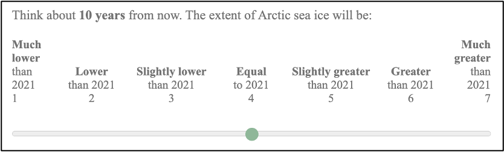
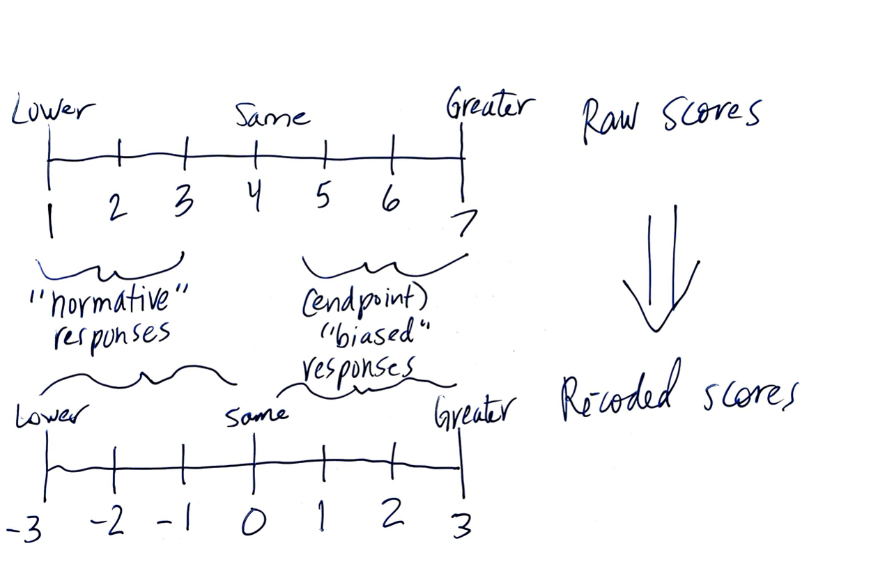
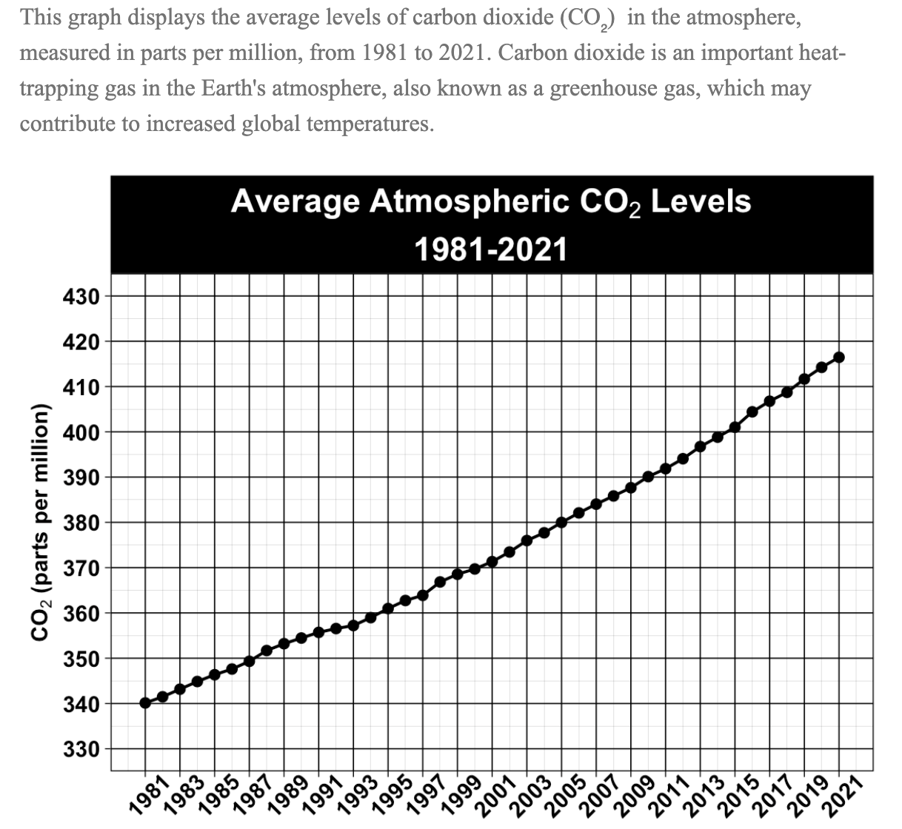

```{r messages-warnings, include=FALSE}
knitr::opts_chunk$set(message=F, warning=F)
```

```{r libraries, echo=F}
library(rio)
library(here)
library(janitor)
library(reshape2)
library(tidyverse)
library(ggplot2)
library(lme4)
library(knitr)
library(Hmisc)
library(viridis)
library(kableExtra)
```

```{r import-data, echo=F}
# 8/15 data
dfd1 <- import(here("analysis-data", "cleaned-data0815.csv"))
dfd1_dt <- import(here("analysis-data", "cleaned-data0815-exdt.csv"))
dfd1_flr <- import(here("analysis-data", "cleaned-data0815-exflr.csv"))

dfd1_lc <- dfd1 %>% 
  filter(conservatism_f != 4 | con != 0)
dfd1_lcdt <- dfd1_dt %>% 
  filter(conservatism_f != 4 | con != 0)
dfd1_lcflr <- dfd1_flr %>% 
  filter(conservatism_f != 4 | con != 0)

# 10/31 data
dfch0 <- import(here("analysis-data", "cleaned-data1031.csv"))

dfch2 <- dfch0 %>% 
  filter(aot_zscored > -3)

dfch3 <- dfch0 %>% 
  filter(aot_zscored > -2)

dfch4 <- dfch0 %>% 
  filter(aot_zscored > -3 & vl_zscored > -3 & nfc_zscored > -3 & 
           sc_scoredz > -3 & sc_scoredz < 3)
```

```{r 815-desc-names, echo=F}
dfd1 <- dfd1 %>% 
  mutate(RPM = rav_scored,
         SciCuriosity = sc_scored,
         ConArctic = arctic20,
         ConTemp = temp20,
         LibOzone = ozone20,
         LibAir = airqual20,
         FillConCO2 = co220,
         FillConIce = icesheets20,
         ConFillCO2 = co220,
         ConFillIce = icesheets20,
         FillDiaPop = diatho20,
         FillBacteria = diatho20,
         FillQuake = quake20,
         Con = con)

dfd1_lc <- dfd1_lc %>% 
  mutate(RPM = rav_scored,
         SciCuriosity = sc_scored,
         ConArctic = arctic20,
         ConTemp = temp20,
         LibOzone = ozone20,
         LibAir = airqual20,
         FillConCO2 = co220,
         FillConIce = icesheets20,
         ConFillCO2 = co220,
         ConFillIce = icesheets20,
         FillDiaPop = diatho20,
         FillBacteria = diatho20,
         FillQuake = quake20,
         Con = con)

desc_mr_var_names <- dfd1_lc %>% 
  mutate(RPM = rav_scored,
         SciCuriosity = sc_scored,
         ConArctic = arctic20,
         ConTemp = temp20,
         LibOzone = ozone20,
         LibAir = airqual20,
         ConFillCO2 = co220,
         ConFillIce = icesheets20,
         FillBacteria = diatho20,
         FillQuake = quake20,
         Con = con)
```

```{r func-se, echo=F}
se_f <- function(x) {
  
  if(length(x) > 0) {
    sd(x, na.rm = T) / sqrt(length(x))
  }
  else {
    999
  }
}
```

```{r func-upper-tri}
get_upper_tri_list <- function(cormat){
    
  r <- cormat[1]
  n <- cormat[2]
  p <- cormat[3]
  
  r[lower.tri(r)] <- NA
  p[lower.tri(p)] <- NA
  
  cormat_u <- list(r, n, p)
    
    return(cormat_u)
}

get_upper_tri <- function(cormat){
    cormat[lower.tri(cormat)]<- NA
    return(cormat)
  }
```

# Methods

**Abstract.** In a preregistered study, we test the relationship between science curiosity and motivated reasoning, extending work by Kahan et al. (2017) in which high science curiosity was associated with less selective exposure to politicized science news stories. N=541 participants completed a motivated reasoning task in which they viewed graphs of NASA climate change data and predicted future trends in those data before completing a validated science curiosity inventory We predicted that participants higher in science curiosity would engage in less motivated reasoning (measured through selective endpoint bias) than those lower in science curiosity, controlling for cognitive ability and political ideology.

## Data collection

This study was run on Amazon Mechanical Turk via CloudResearch and utilized CAIDe lab's Cohort 4. It was conducted in two parts: cognitive ability and demographics (including political ideology) were collected in a baseline survey, and participants completed the motivated reasoning items and science curiosity scale in a second survey. Our target sample size was N=750, but we didn't received enough responses.

**Baseline: August 16-17, 2021**

1. SNS
2. NFC
3. Climate risk perception
4. NSE
5. Adaptive ONS (and confidence)
6. RPM (and confidence)
7. Vocab (and confidence)
8. Verbal logic (analogies; and confidence)
9. Political knowledge (and confidence)
10. AOT
11. COVID-19 vaccine screener
12. Demographics (ANES political ideology)

**Current Study: July 13-26, 2022**

1. **Motivated reasoning task** (slope direction)
  + Practice item/attention check (0)
  + 4 ambiguous political items
    + 2 conservative: arctic sea ice (-) and global temperature index (+)
    + 2 liberal: ozone hole (-) and US air quality (+)
    + All participants saw one of these four items, randomly-selected, as their first item after the practice item
  + 2 unambiguous political items
    + Both conservative: ice sheets (-) and CO2 (+)
  + 1 ambiguous nonpolitical item
    + Bacteria population density (-)
  + 1 unambiguous nonpolitical item
    + Earthquake magnitude (0)
2. **Modified version of Kahan et al. (2017) science curiosity scale**
3. **Data quality**

## Preregistration

A preregistration was [posted on OSF](https://osf.io/t2g4f/?view_only=7e8cc5ffc90e4ad2a028a638eea758d8). Below is a summary of key points (using original language found in the preregistration).

**Variables**

* Item congruence
* Item-level endpoint bias
* Ideologically-motivated response inconsistency (IMRI)
* Science curiosity
* Cognitive ability
* Political ideology
* Climate change risk perception
* Demographics

**Hypotheses**

* **H1.** Trait science curiosity will moderate the relationship between item congruence and item-level endpoint bias. Higher (vs. lower) trait science curiosity will be associated with less endpoint bias on congruent (vs. incongruent) items.
* **H2.** There will be a main effect of science curiosity on ideologically-motivated response inconsistency. Participants higher (vs. lower) in science curiosity will be less likely to demonstrate ideologically-motivated response inconsistencies between congruent and incongruent items.

Analysis plan

* **H1.** We will use a multilevel modeling approach with random intercepts and slopes, wherein item-level performance values are nested within participants. The outcome variable in the model will be performance scores on all items for all participants (resulting in 3N observations). The predictor variables will be item congruence and science curiosity scores. Cognitive ability and political ideology will be included as covariates.
  + **Manipulation check.** With this model, we will also test whether there is a significant relationship between item congruence and item-level endpoint bias, such that participants exhibit greater endpoint bias on congruent items (vs. incongruent items).
* **H2.** We will test a logistical regression model wherein IMRI values (0 or 1) are predicted by science curiosity scores, controlling for cognitive ability and political ideology.
* **Data exclusion.** We will exclude participant data for any of the following reasons:
  + a participant’s IP address is outside of the US,
  + a participant responds to a self-report item suggesting exclusion (e.g., reports random responding or significant distraction during survey completion),
  + a participant exhibits poor performance (e.g., z < -3) on control/filler graph items,
  + a participant fails an attention check item, 
  + a participant submits a nonsense response on an open-ended item, 
  + and/or a participant exhibits a survey completion time more extreme than +/-3 SD of the mean.
* **Exploratory analyses.**
  + We plan to explore the predictive power of participants’ climate change risk perceptions (a more proximal measure) relative to their reported political ideology. Similarly, we may also explore numeracy as a covariate instead of or alongside their performance on the RPM task. 
  + The coding scheme for the IMRI variable has not yet been tested with this paradigm, so H2 and its analyses are ultimately exploratory. With this preliminary study, we may develop a better approach for testing H2, which we could then implement in future studies. 
  + We may utilize participants’ 10-year predictions in an exploratory analysis. Specifically, we may test the utility of examining the difference scores or slopes created by participants’ 10- and 20-year predictions for each item in measuring endpoint bias.
  
## Materials

**Coding motivated reasoning items**






In this document, for the sake of simplicity, I'll refer to the recoded scores as "endpoint bias scores." However, as we've previously discussed (and as we'll see later in this doc), our findings do not necessarily support the idea that the mechanism behind polarization on these items is due to endpoint bias.

# Data Prepping and Cleaning

## Outliers and exclusions

Final df is excluding:

* Duplicates
* Unfinished
* Reported cheating
* Reported bad response
* Unapproved
* Did not consent
* Was not in both dfs (b and s1)
* Outliers:
  + Duration (1)
  + Science Curiosity (0) XXX i think fix i think wrong
  + Raven's Progressive Matrices (2)

**Attention check.** 381 people failed the attention check, which is honestly pretty impressive! Was clearly not a good attention check. I don't think this is a red flag for data quality, though.

## Order effects

# Descriptives

## Demographics

```{r Ss, echo=F}
n_total <- dfd1 %>% 
  nrow()

n_total_lc <- dfd1_lc %>% 
  nrow()

n_by_con <- dfd1 %>% 
  group_by(con) %>% 
  summarise(n = n(),
            percent = round(100 * (n()/nrow(dfd1)), 2))

n_by_con_lc <- dfd1_lc %>% 
  group_by(con) %>% 
  summarise(n = n(),
            percent = round(100 * (n()/nrow(dfd1_lc)), 2))

df_age <- dfd1 %>% 
  select(dem_age_b) %>% 
  psych::describe()

m_age <- df_age$mean %>% 
  round(2)
min_age <- df_age$min %>% 
  round(2)
max_age <- df_age$max %>% 
  round(2)

df_gender <- dfd1 %>% 
  group_by(gender_b) %>% 
  summarise(n = n(),
            percent = round(100 *(n()/nrow(dfd1)),2))

df_race <- dfd1 %>% 
  group_by(race_b) %>% 
  summarise(n = n(),
            percent = round(100 *(n()/nrow(dfd1)),2))
```

**N$_{total}$ = `r n_total`**

* **Political ideology:** `r n_by_con[3,3]`% conservative, `r n_by_con[1,3]`% liberal, `r n_by_con[2,3]`% moderate
  + N$_{con}$ = `r n_by_con[3,2]`, N$_{lib}$ = `r n_by_con[1,2]`, N$_{mod}$ = `r n_by_con[2,2]`
* **Age:** Mean$_{age}$ = `r m_age` (range: `r min_age`-`r max_age`)
* **Gender:** `r df_gender[3,3]`% women, `r df_gender[1,3]`% men, `r df_gender[2,3]`% non-binary folks, `r df_gender[4,3]`% preferred not to answer
* **Race:** `r df_race[1,3]`% White, `r df_race[2,3]`% Black, `r df_race[3,3]`% Hispanic, `r df_race[4,3]`% Asian

## Correlations

```{r cor-mat1-prep, echo=F}
dfp_corr <- dfd1_lc %>% 
  select(conservatism_f, sc_scored, rav_scored, arctic20, temp20, ozone20, airqual20, co220, icesheets20, diatho20, quake20) %>% 
  mutate(Con = conservatism_f,
         SciCur = sc_scored,
         RPM = rav_scored,
         ConArctic = arctic20,
         ConTemp = temp20,
         LibOzone = ozone20,
         LibAirQual = airqual20,
         FillConCO2 = co220,
         FillConIce = icesheets20) %>% 
  select(-contains("20"), -contains("scored"), -contains("_f"))
```

```{r corr-mat1, eval=F}
dfp_corr2 <- dfd1_lc %>% 
  select(conservatism_f, sc_scored, rav_scored, arctic20, temp20, ozone20, airqual20, co220, icesheets20, diatho20, quake20) %>% 
  mutate(Con = conservatism_f,
         SciCur = sc_scored,
         RPM = rav_scored,
         ConArctic = arctic20,
         ConTemp = temp20,
         Ozone = ozone20,
         AirQual = airqual20,
         ConFillCO2 = co220,
         ConFillIce = icesheets20,
         FillBacteria = diatho20,
         FillQuake = quake20) %>% 
  select(-contains("20"), -contains("scored"), -contains("_f"))

cor(dfp_corr2) %>% 
  get_upper_tri() %>% 
  melt() %>% 
  ggplot(aes(x = Var1, y = Var2, fill = value)) +
  geom_tile(color = "white") +
  scale_fill_viridis(limits = c(-1,1), discrete=FALSE, option = "A",
                     name="Pearson\nCorrelation") +
  theme_minimal() +
  theme(axis.text.x = element_text(angle = 25, vjust = 1, 
    size = 13, hjust = 1)) +
  coord_fixed() +
  geom_text(aes(Var1, Var2, label = round(value, 2)), color = "white", size = 3) +
  theme(
    axis.text.y = element_text(size = 13),
    axis.title.x = element_blank(),
    axis.title.y = element_blank(),
  panel.background = element_blank(),
  panel.grid.major = element_blank()) +
  labs(caption = "Conservatism (Con): Extremely liberal (1) to Extremely conservative (7).")
```

### cor 2

```{r cor-mat-prep2, echo=F}
df_cor <- rcorr(as.matrix(dfp_corr))[[1]] 

# %>% 
#   as.data.frame()

df_pcor <- rcorr(as.matrix(dfp_corr))[[3]] %>% 
  get_upper_tri() %>% 
  melt() %>% 
  mutate(p05 = case_when(
    value < 0.1 & value >= 0.05 ~ 1,
    value < 0.05 & value >= 0.01 ~ 2,
    value < 0.01 & value >= 0.001 ~ 3,
    value < 0.001 ~ 4,
    TRUE ~ 999
  ))

ps <- df_pcor$p05

```

```{r cor-mat2, eval=F}
df_cor %>% 
  get_upper_tri() %>% 
  melt() %>% 
  ggplot(aes(x = Var1, y = Var2)) +
  geom_tile(aes(fill = factor(ps)), color = "black") +
  scale_fill_manual(values = c("#66CC00", "#FFFF66", "#FF9933", "#FF3300", "white"), name = "p values",
                    labels = c(
                      "0.1 > p > 0.05",
                      "0.05 > p > 0.01",
                      "0.01 > p > 0.001",
                      "p > 0.001",
                      "ignore :~)"
                    )) +
  theme_minimal() +
  theme(axis.text.x = element_text(angle = 25, vjust = 1, 
    size = 13, hjust = 1)) +
  coord_fixed() +
  geom_text(aes(Var1, Var2, label = round(value, 2)), size = 3) +
  theme(
    axis.text.y = element_text(size = 13),
    axis.title.x = element_blank(),
    axis.title.y = element_blank(),
  panel.background = element_blank(),
  panel.grid.major = element_blank()) +
  labs(caption = "Conservatism (Con): Extremely liberal (1) to Extremely conservative (7).")
```

```{r heat-map2, echo=F, eval=F}
cor(dfp_corr) %>% 
  get_upper_tri() %>% 
  melt() %>% 
  ggplot(aes(x = Var1, y = Var2, fill = value)) +
  geom_tile(color = "white") +
  scale_fill_viridis(limits = c(-1,1), discrete=FALSE, option = "A",
                     name="Pearson\nCorrelation") +
  theme_minimal() +
  theme(axis.text.x = element_text(angle = 25, vjust = 1, 
    size = 13, hjust = 1)) +
  coord_fixed() +
  geom_text(aes(Var1, Var2, label = round(value, 2)), color = "white", size = 3) +
  theme(
    axis.text.y = element_text(size = 13),
    axis.title.x = element_blank(),
    axis.title.y = element_blank(),
  panel.background = element_blank(),
  panel.grid.major = element_blank()) +
  labs(caption = "Conservatism (Con): Extremely liberal (1) to Extremely conservative (7).")
```

## desc table sc rpm

```{r basic-desc-tab, echo=F}
scrpm_tab <- dfd1_lc %>% 
  mutate(RPM = rav_scored,
         SciCuriosity = sc_scored,
         ConArctic = arctic20,
         ConTemp = temp20,
         LibOzone = ozone20,
         LibAir = airqual20,
         ConFillCO2 = co220,
         ConFillIce = icesheets20,
         FillBacteria = diatho20,
         FillQuake = quake20) %>% 
  select(SciCuriosity, RPM, ConArctic, ConTemp, LibOzone, LibAir, ConFillIce, FillBacteria, FillQuake) %>% 
  psych::describe() %>% 
  mutate(Min = min,
         Max = max,
         Mean = round(mean, 2),
         SD = round(sd, 2),
         Median = median,
         Skew = round(skew, 2)) %>% 
  as.data.frame() %>% 
  select(Min, Max, SD, Mean, Median, Skew) %>% 
  kable()
```

## desc tab by ideo

```{r desc2-tab}
desc_mr_con <- desc_mr_var_names %>% 
  filter(Con == 1) %>% 
  select(SciCuriosity, RPM, ConArctic, ConTemp, LibOzone, LibAir, ConFillIce, FillBacteria, FillQuake) %>%
  psych::describe()%>% 
  mutate(C_Min = min,
         C_Max = max,
         M_c = round(mean, 2),
         SD_c = round(sd, 2),
         C_Median = median,
         Skew_c = round(skew, 2)) %>% 
  as.data.frame() %>% 
  select(M_c, SD_c, Skew_c)

desc_mr_lib <- desc_mr_var_names %>% 
  filter(Con == -1) %>% 
  select(SciCuriosity, RPM, ConArctic, ConTemp, LibOzone, LibAir, ConFillIce, FillBacteria, FillQuake) %>%
  psych::describe()%>% 
  mutate(L_Min = min,
         L_Max = max,
         M_l = round(mean, 2),
         SD_l = round(sd, 2),
         L_Median = median,
         Skew_l = round(skew, 2)) %>% 
  as.data.frame() %>% 
  select(M_l, SD_l, Skew_l)

desc_mr <- cbind(desc_mr_con, desc_mr_lib) %>% 
  select(contains("_c"), contains("_l")) %>% 
  kable() %>% 
  add_header_above(c(" " = 1, "Conservative" = 3, "Liberal" = 3))
```

```{r prep-desc2-plot, echo=F}
desc_long <- desc_mr_var_names %>% 
  pivot_longer(cols = c(SciCuriosity, RPM, ConArctic, ConTemp, LibOzone, LibAir, ConFillIce, FillBacteria, FillQuake), names_to = "Variable", values_to = "Score")

desc_long_mr <- desc_long %>% 
  filter(Variable != "SciCuriosity" & Variable != "RPM") 
```

```{r desc2-plot, echo=F}
desc_long_cont <- desc_long %>% 
  filter(Variable == "SciCuriosity" | Variable == "RPM")

# desc_long_cont %>% 
#   select(Score) %>% 
#   unique()

desc_long_cont %>% 
  ggplot(., aes(x = as.factor(Con), y = Score, fill = as.factor(Con))) + 
  stat_summary(geom = "bar", fun = "mean", position = "dodge") +
  facet_wrap(~Variable, scales = "free_y") +
  scale_x_discrete(labels = c("Lib", "Con")) +
  scale_fill_manual(values = c("deepskyblue3", "brown3")) +
  theme_bw() +
  labs(title = "Average Cognitive Ability and Science Curiosity",
       y = "Average Score",
       x = "Ideology") +
  theme(axis.text.x = element_text(size = 12),
        axis.text.y = element_text(size = 12),
        axis.title.x = element_text(size = 14),
        axis.title.y = element_text(size = 14),
        legend.position = "none",
        plot.title = element_text(size = 16, face = "bold", hjust = .5))
```

## sc rpm again

```{r scrpm-tab-lc-prep, echo=F}
desc_scrpm_con <- dfd1_lc %>% 
  filter(Con == 1) %>% 
  select(SciCuriosity, RPM) %>%
  psych::describe()%>% 
  mutate(Min_c = min,
         Max_c = max,
         Mean_c = mean,
         SE_c = se) %>% 
  as.data.frame() %>% 
  select(Mean_c, SE_c, Min_c, Max_c)

desc_scrpm_lib <- dfd1_lc %>% 
  filter(Con == -1) %>% 
  select(SciCuriosity, RPM) %>%
  psych::describe()%>% 
  mutate(Min_l = min,
         Max_l = max,
         Mean_l = mean,
         SE_l = se) %>% 
  as.data.frame() %>% 
  select(Mean_l, SE_l, Min_l, Max_l)

cbind(desc_scrpm_con, desc_scrpm_lib) %>% 
  select(contains("_c"), contains("_l")) %>% 
  kable(digits = 2, align = "c",
        col.names = c(
          rep(c("Mean", "SE", "Min", "Max"), 2)
        )) %>% 
  add_header_above(c(" " = 1, "Conservative" = 4, "Liberal" = 4), line_sep = 25) %>% 
  kable_styling(full_width = F, position = "left")%>% 
  column_spec(column = 1, bold = T) %>% 
  column_spec(column = c(2,4,6,8), background = "lightgray") %>% 
  column_spec(column = c(1,5), border_right = T)
```

```{r scrpm-plot-lc-prep, echo=F}
desc_long <- dfd1_lc %>% 
  pivot_longer(cols = c(SciCuriosity, RPM, ConArctic, ConTemp, LibOzone, LibAir, FillConIce, FillConCO2, FillDiaPop, FillQuake), names_to = "Variable", values_to = "Score")

desc_long_mr <- desc_long %>% 
  filter(Variable != "SciCuriosity" & Variable != "RPM") 
```

```{r scrpm-plot-lc, echo=F}
desc_long_cont <- desc_long %>% 
  filter(Variable == "SciCuriosity" | Variable == "RPM")

# desc_long_cont %>% 
#   select(Score) %>% 
#   unique()

desc_long_cont %>% 
  ggplot(., aes(x = as.factor(Con), y = Score, fill = as.factor(Con))) + 
  stat_summary(geom = "bar", fun = "mean", position = "dodge") +
  facet_wrap(~Variable, scales = "free_y") +
  scale_x_discrete(labels = c("Lib", "Con")) +
  scale_fill_manual(values = c("deepskyblue3", "brown3")) +
  theme_bw() +
  labs(title = "Average Cognitive Ability and Science Curiosity",
       y = "Average Score",
       x = "Ideology") +
  theme(axis.text.x = element_text(size = 12),
        axis.text.y = element_text(size = 12),
        axis.title.x = element_text(size = 14),
        axis.title.y = element_text(size = 14),
        legend.position = "none",
        plot.title = element_text(size = 16, face = "bold", hjust = .5))
```

## mr items

```{r desc-table-ideo, echo=F}
desc_mr_con <- dfd1_lc %>% 
  filter(Con == 1) %>% 
  select(ConArctic, ConTemp, LibOzone, LibAir, ConFillIce, FillBacteria, FillQuake) %>% 
  psych::describe()%>% 
  mutate(Min_c = min,
         Max_c = max,
         Mean_c = mean,
         SE_c = se) %>% 
  as.data.frame() %>% 
  select(Mean_c, SE_c, Min_c, Max_c)

desc_mr_lib <- dfd1_lc %>% 
  filter(Con == -1) %>% 
  select(ConArctic, ConTemp, LibOzone, LibAir, ConFillIce, FillBacteria, FillQuake) %>%
  psych::describe() %>% 
  mutate(Min_l = min,
         Max_l = max,
         Mean_l = mean,
         SE_l = se) %>% 
  as.data.frame() %>% 
  select(Mean_l, SE_l, Min_l, Max_l)

cbind(desc_mr_con, desc_mr_lib) %>% 
  select(contains("_c"), contains("_l")) %>% 
  kable(digits = 2, align = "c",
        col.names = c(
          rep(c("Mean", "SE", "Min", "Max"), 2)
        )) %>% 
  add_header_above(c(" " = 1, "Conservative" = 4, "Liberal" = 4), line_sep = 25) %>% 
  kable_styling(full_width = F, position = "left")%>% 
  column_spec(column = 1, bold = T) %>% 
  column_spec(column = c(2,4,6,8), background = "lightgray") %>% 
  column_spec(column = c(1,5), border_right = T)
```

## "endpoint by ideology"

```{r eb-ideo-plot, echo=F}
desc_long_mr %>% 
  ggplot(., aes(x = Variable, y = Score, fill = as.factor(Con))) + 
  stat_summary(geom = "bar", fun = "mean", position = "dodge") +
  scale_fill_manual(values = c("deepskyblue3", "brown3"), name = "Ideology", labels = c("Lib", "Con")) +
  theme_bw() +
  scale_y_continuous(limits = c(-3, 1), breaks = seq(from  = -3, to = 1, by = .5)) +  
  labs(title = "Average Scores on Motivated Reasoning Items",
       subtitle = "Higher scores indicate more endpoint bias.",
       y = "Average Score",
       x = "Item") +
  theme(axis.text.x = element_text(angle = 45, size = 12, vjust = .6),
        axis.text.y = element_text(size = 12),
        axis.title.x = element_text(size = 14),
        axis.title.y = element_text(size = 14),
        legend.text = element_text(size = 12),
        legend.title = element_text(size = 12),
        plot.title = element_text(size = 16, face = "bold", hjust = .5),
        plot.subtitle = element_text(size = 12, hjust = .13))
```

## 3 way int means

```{r add-cong-var, echo=F}
dfd2_lc <- dfd1_lc %>% 
  mutate(ArcticCong = case_when(
    Con == 1 ~ 1,
    Con == -1 ~ 0,
    TRUE ~ 999),
    TempCong = case_when(
      Con == 1 ~ 1,
      Con == -1 ~ 0,
      TRUE ~ 999),
    OzoneCong = case_when(
      Con == 1 ~ 0,
      Con == -1 ~ 1,
      TRUE ~ 999),
    AirCong = case_when(
      Con == 1 ~ 0,
      Con == -1 ~ 1,
      TRUE ~ 999)
         )

dfd2_lc <- dfd2_lc %>% 
  mutate(sc3 = case_when(
    sc_scoredz < 0 ~ "Low",
    sc_scoredz == 0 ~ "Avg",
    sc_scoredz > 0 ~ "High"
  ),
  rpm3 = case_when(
    rav_scoredz < 0 ~ "Low",
    rav_scoredz == 0 ~ "Avg",
    rav_scoredz > 0 ~ "High"
  ),
  ideo2 = case_when(
    con == 1 ~ "Con",
    con == -1 ~ "Lib"
  )
  )
```

```{r 3way-means, echo = F}
int_means <- dfd2_lc %>% 
  group_by(sc3, rpm3, ideo2) %>% 
  summarise_at(vars("ConArctic", "ConTemp", "LibOzone", "LibAir"), funs(mean, se_f, length))

int_means_tab <- int_means %>% 
  select(-contains("length")) %>% 
  select(sc3, rpm3, ideo2, contains("Arctic"), contains("Temp"), contains("Ozone"), contains("Air"))

int_means_tab %>% 
  select(ideo2, sc3, -rpm3, everything()) %>% 
  arrange(ideo2, sc3) %>% 
  kable(digits = 2,
        align = "c",
        col.names = c("", "SciCur", "RPM", "Con1_M", "Con1_SE", "Con2_M", "Con2_SE", "Lib1_M", "Lib1_SE", "Lib2_M", "Lib2_SE")) %>% 
  add_header_above(c(" " = 3, "Conservative" = 4, "Liberal" = 4), line_sep = 25) %>%
  kable_styling(position = "left") %>% 
  row_spec(row = c(1, 2, 5, 6), background = "lightgray") %>% 
  column_spec(column = 1, bold = T, color = "white", background = c("maroon", "maroon", "maroon", "maroon", "royalblue", "royalblue", "royalblue", "royalblue")) %>% 
  column_spec(colum = c(3, 5, 7, 9), border_right = T) %>% 
  footnote(general = "* M = mean, SE = standard error \n * Item names: Con1 = arctic sea ice, Con2 = global temperature index, Lib1 = ozone layer hole, Lib2 = US air quality")
```

## By item.

### Conservative #1: Arctic
```{r arc1, echo=F}
int_means_tab %>% 
  ggplot(aes(x = sc3, y = ConArctic_mean, fill = ideo2)) +
  geom_bar(stat = "identity", position = "dodge")
```

```{r arc2}
arcmod1 <- lm(ConArctic ~ 1, data = dfd2_lc)
summary(arcmod1)

arcmod2 <- lm(ConArctic ~ rav_scoredz, data = dfd2_lc)
summary(arcmod2)

anova(arcmod1, arcmod2)

arcmod3 <- lm(ConArctic ~ sc_scoredz + rav_scoredz, data = dfd2_lc)
summary(arcmod3)

anova(arcmod1, arcmod3)

arcmod4 <- lm(ConArctic ~ ArcticCong + sc_scoredz + rav_scoredz, data = dfd2_lc)
summary(arcmod4)

anova(arcmod1, arcmod4)
```

### Conservative #2: Temp
```{r temp1, echo=F}
int_means_tab %>% 
  ggplot(aes(x = sc3, y = ConTemp_mean, fill = ideo2)) +
  geom_bar(stat = "identity", position = "dodge")
```

```{r temp2}
tempmod1 <- lm(ConTemp ~ 1, data = dfd2_lc)
summary(tempmod1)

tempmod2 <- lm(ConTemp ~ rav_scoredz, data = dfd2_lc)
summary(tempmod2)

anova(tempmod1, tempmod2)

tempmod3 <- lm(ConTemp ~ sc_scoredz + rav_scoredz, data = dfd2_lc)
summary(tempmod3)

anova(tempmod1, tempmod3)

tempmod4 <- lm(ConTemp ~ TempCong + sc_scoredz + rav_scoredz, data = dfd2_lc)
summary(tempmod4)

anova(tempmod3, tempmod4)
```

### Liberal #1: Ozone
```{r oz1, echo=F}
int_means_tab %>% 
  ggplot(aes(x = sc3, y = LibOzone_mean, fill = ideo2)) +
  geom_bar(stat = "identity", position = "dodge")
```

```{r oz2}
ozmod1 <- lm(LibOzone ~ 1, data = dfd2_lc)
summary(ozmod1)

ozmod2 <- lm(LibOzone ~ rav_scoredz, data = dfd2_lc)
summary(ozmod2)

anova(ozmod1, ozmod2)

ozmod3 <- lm(LibOzone ~ sc_scoredz + rav_scoredz, data = dfd2_lc)
summary(ozmod3)

anova(ozmod1, ozmod3)

ozmod4 <- lm(LibOzone ~ OzoneCong + sc_scoredz + rav_scoredz, data = dfd2_lc)
summary(ozmod4)

anova(ozmod1, ozmod4)
```

### Liberal #2: Air Quality
```{r aq1, echo=F}
int_means_tab %>% 
  ggplot(aes(x = sc3, y = LibAir_mean, fill = ideo2)) +
  geom_bar(stat = "identity", position = "dodge") 
```

```{r aq2}
airmod1 <- lm(LibAir ~ 1, data = dfd2_lc)
summary(airmod1)

airmod2 <- lm(LibAir ~ rav_scoredz, data = dfd2_lc)
summary(airmod2)

anova(airmod1, airmod2)

airmod3 <- lm(LibAir ~ sc_scoredz + rav_scoredz, data = dfd2_lc)
summary(airmod3)

anova(airmod1, airmod3)

airmod4 <- lm(LibAir ~ AirCong + sc_scoredz + rav_scoredz, data = dfd2_lc)
summary(airmod4)

anova(airmod1, airmod4)
```

## Some models idek.

```{r item-hists, plot-x}
dfd1 %>%
  ggplot(aes(x = arctic20)) +
  geom_histogram(binwidth = 1)

dfd1 %>%
  ggplot(aes(x = temp20)) +
  geom_histogram(binwidth = 1)

dfd1 %>%
  ggplot(aes(x = ozone20)) +
  geom_histogram(binwidth = 1)

dfd1 %>%
  ggplot(aes(x = airqual20)) +
  geom_histogram(binwidth = 1)
```

```{r item-linear-models}
amodel1 <- lm(data = dfd1, formula = arctic20 ~ con + rav_scored)
summary(amodel1)

amodel2 <- lm(data = dfd1, formula = arctic20 ~ sc_scored + con + rav_scored)
summary(amodel2)

tmodel1 <- lm(data = dfd1, formula = temp20 ~ con + rav_scored)
summary(tmodel1)

tmodel2 <- lm(data = dfd1, formula = temp20 ~ sc_scored + con + rav_scored)
summary(tmodel2)

omodel1 <- lm(data = dfd1, formula = ozone20 ~ con + rav_scored)
summary(omodel1)

omodel2 <- lm(data = dfd1, formula = ozone20 ~ sc_scored + con + rav_scored)
summary(omodel2)

aqmodel1 <- lm(data = dfd1, formula = airqual20 ~ con + rav_scored)
summary(aqmodel1)

aqmodel2 <- lm(data = dfd1, formula = airqual20 ~ sc_scored + con + rav_scored)
summary(aqmodel2)
```

## and more

```{r add-cong-var2, echo=F}
dfd2_lc <- dfd1_lc %>% 
  mutate(ArcticCong = case_when(
    Con == 1 ~ 1,
    Con == -1 ~ 0,
    TRUE ~ 999),
    TempCong = case_when(
      Con == 1 ~ 1,
      Con == -1 ~ 0,
      TRUE ~ 999),
    OzoneCong = case_when(
      Con == 1 ~ 0,
      Con == -1 ~ 1,
      TRUE ~ 999),
    AirCong = case_when(
      Con == 1 ~ 0,
      Con == -1 ~ 1,
      TRUE ~ 999),
    CO2Cong = case_when(
      Con == 1 ~ 1,
      Con == -1 ~ 0,
      TRUE ~ 999),
    IceCong = case_when(
      Con == 1 ~ 1,
      Con == -1 ~ 0,
      TRUE ~ 999)
         )
```

## 3 way one last time

```{r scrpm-hilow, echo=F}
dfd2_lc <- dfd2_lc %>% 
  mutate(sc3 = case_when(
    sc_scoredz < -1.5 ~ "Below Avg",
    sc_scoredz >= -1.5 & sc_scoredz <= 1.5 ~ "Avg",
    sc_scoredz > 1.5 ~ "Above Avg"
  ),
  rpm3 = case_when(
    rav_scoredz < -1.5 ~ "Below Avg",
    rav_scoredz >= -1.5 & rav_scoredz <= 1.5 ~ "Avg",
    rav_scoredz > 1.5 ~ "Above Avg"
  ),
  ideo2 = case_when(
    con == 1 ~ "Con",
    con == -1 ~ "Lib"
  )
  )
```

```{r 3way-means2, echo = F}
int_means <- dfd2_lc %>% 
  group_by(sc3, ideo2) %>% 
  summarise_at(vars("ConArctic", "ConTemp", "LibOzone", "LibAir"), funs(mean, se_f, length))

int_means_tab <- int_means %>% 
  select(-contains("length")) %>% 
  select(sc3, ideo2, contains("Arctic"), contains("Temp"), contains("Ozone"), contains("Air"))

int_means_tab %>% 
  select(ideo2, sc3, everything()) %>% 
  arrange(ideo2, sc3) %>% 
  kable(digits = 2,
        align = "c",
        col.names = c("", "SciCur", "Con1_M", "Con1_SE", "Con2_M", "Con2_SE", "Lib1_M", "Lib1_SE", "Lib2_M", "Lib2_SE")) %>% 
  add_header_above(c(" " = 2, "Conservative" = 4, "Liberal" = 4), line_sep = 25) %>%
  kable_styling(position = "left") %>% 
  row_spec(row = c(1, 2, 3), background = "lightgray") %>% 
  column_spec(column = c(7, 8, 9, 10), background = c("white", "white", "white", "lightgray", "lightgray", "lightgray")) %>% 
  column_spec(column = 1, bold = T, color = "white", background = c("red", "red", "red", "blue", "blue", "blue")) %>% 
  column_spec(column = c(2, 4, 6, 8), border_right = T) %>% 
  column_spec(column = 2, background = "white") %>% 
  footnote(general = "* Higher scores indicate MORE endpoint bias \n * M = mean, SE = standard error \n * Item names: Con1 = arctic sea ice, Con2 = global temperature index, Lib1 = ozone layer hole, Lib2 = US air quality")
```

**Table color coding.**
The areas of the table highlighted in gray indicate for each item whether the endpoint bias was congruent with conservative or liberal beliefs. For example, Con1 and Con2 portrayed endpoint bias congruent with conservative beliefs, so the top gray square highlights the Ms and SEs of conservative participants for each item, grouped by science curiosity scores.

**Science curiosity groupings.**
Above avg: z > 1.5, Avg: -1.5 <= z >= 1.5, Below Avg: z < -1.5

**What would we predict?**
If our hypothesis were correct, in the gray areas of this table, there would be a negative relation between science curiosity and endpoint bias scores, indicating that higher science curiosity scores were associated with less biased responding.

**Looking at these means, what do we see?**
The second conservative item (Con2; related to global temperature) does demonstrate directional consistency with this hypothesis among conservatives (*and* liberals, but with larger SEs). Furthermore, the second liberal item (Lib2; related to air quality) displays directional consistency among conservatives but not liberals.

## Is it endpoint bias?

Unlike other studies, we included a few filler items in the motivated reasoning task, two of which were politicized but with clear trends and no endpoint discrepancy.



```{r 3way-means-fill, echo = F}
int_means <- dfd2_lc %>% 
  group_by(sc3, ideo2) %>% 
  summarise_at(vars("ConArctic", "ConTemp", "FillConCO2", "FillConIce"), funs(mean, se_f, length))

int_means_tab <- int_means %>% 
  select(-contains("length")) %>% 
  select(sc3, ideo2, contains("Arctic"), contains("Temp"), contains("CO2"), contains("Ice"))

int_means_tab %>% 
  select(ideo2, sc3, everything()) %>% 
  arrange(ideo2, sc3) %>% 
  kable(digits = 2,
        align = "c",
        col.names = c("", "SciCur", "Con1_M", "Con1_SE", "Con2_M", "Con2_SE", "Fill1_M", "Fill1_SE", "Fill2_M", "Fill2_SE")) %>% 
  add_header_above(c(" " = 2, "Cons MR Items" = 4, "Con Filler Items" = 4), line_sep = 25) %>%
  kable_styling(position = "left") %>% 
  row_spec(row = c(1, 2, 3), background = "lightgray") %>% 
  # column_spec(column = c(7, 8, 9, 10), background = c("white", "white", "white", "lightgray", "lightgray", "lightgray")) %>% 
  column_spec(column = 1, bold = T, color = "white", background = c("red", "red", "red", "blue", "blue", "blue")) %>% 
  column_spec(column = c(2, 4, 6, 8), border_right = T) %>% 
  column_spec(column = c(2, 3, 4, 5, 6), background = "white") %>% 
  footnote(general = "* Higher scores indicate MORE endpoint (?) bias \n * M = mean, SE = standard error \n * Item names: Con1 = arctic sea ice, Con2 = global temperature index, Fill1 = CO2 levels, Lib2 = ice sheet area")
```

**What's going on?**
As we would expect, because their trends were not ambiguous, endpoint bias scores were lower for the filler items compared to the motivated reasoning items. Interestingly, though, they were still significantly polarized by ideology, despite the fact that we instructed participants to make their prediction "based on the given information."

**So what?**
Based on these results, we can't necessarily determine whether endpoint bias was the mechanism behind polarized responding. In the case of these filler items, we know that it was not simply based on the definition of endpoint bias. Does this indicate, even in our motivated reasoning items, that this is not so much motivated reasoning as biased responding based on existing attitudes? Or are two different mechanisms at play between the filler and the endpoint items? We'd need to know more about the precise reasoning (or lack thereof) that formed their responses. This is one potential question we could examine in a follow-up study, potentially independent of science curiosity.

```{r ch-vars-tabs}
desc_ch_c <- dfch2 %>% 
  filter(con == 1) %>% 
  select(ArcIce_2, TempCO2_2) %>%
  psych::describe()%>% 
  mutate(C_Min = min,
         C_Max = max,
         M_c = round(mean, 2),
         SD_c = round(sd, 2),
         C_Median = median,
         Skew_c = round(skew, 2)) %>% 
  as.data.frame() %>% 
  select(M_c, SD_c, Skew_c)

desc_ch_l <- dfch2 %>% 
  filter(con == -1) %>% 
  select(ArcIce_2, TempCO2_2) %>%
  psych::describe()%>% 
  mutate(L_Min = min,
         L_Max = max,
         M_l = round(mean, 2),
         SD_l = round(sd, 2),
         L_Median = median,
         Skew_l = round(skew, 2)) %>% 
  as.data.frame() %>% 
  select(M_l, SD_l, Skew_l)

desc_ch_j <- cbind(desc_ch_c, desc_ch_l) %>% 
  select(contains("_c"), contains("_l")) %>% 
  kable() %>% 
  add_header_above(c(" " = 1, "Conservative" = 3, "Liberal" = 3))
```

## arcice

```{r ch-mods}
ch_mod <- lm(data = dfch2, formula = ArcIce_2 ~ con + rav_scoredz)

ch_mod <- lm(data = dfch2, formula = temp20_ch ~ con + rav_scoredz + 
               sc_scoredz + diatho20_ch)

summary(ch_mod)

```

# Preregistered Analyses

## MLM (H1)

### attempt 1
```{r mlm-attempt, echo=F, eval=F}
# rcorr(dfd1_lc$sc_scored, dfd1_lc$rav_scored)

sc_1 <- lm(sc_scored ~ 1, dfd1_lc)
summary(sc_1)
scrpm <- lm(sc_scored ~ 1 + rav_scored, dfd1_lc)
summary(scrpm)
anova(sc_1, scrpm)
```

### attempt 2
```{r import-data-mlm}
dfmlm <- import(here("analysis-data", "cleaned-data.csv"))
```

```{r mlm-df}
dfmlm1 <- dfmlm %>% 
  pivot_longer(., cols = c(prac2_1_sc, arctic2_1_sc, temp2_1_sc, ozone2_1_sc,
                           air_qual2_1_sc, dia_tho2_1_sc, co22_1_sc, 
                           ice_sheets2_1_sc, quake2_1_sc),
               names_to = "item",
               values_to = "response",
               values_drop_na = T)
```

```{r mlm-vars}
dfmlm2 <- dfmlm1 %>% 
  select(id, con, conservatism_f, item, response, sc_scored, sc_scoredz, 
         rav_scored, rav_scoredz) %>% 
  mutate(item_slope = factor(case_when(
    item == "arctic2_1_sc" | item == "ozone2_1_sc" | item == "ice_sheets2_1_sc" |
      item == "air_qual2_1_sc" ~ "neg",
    item == "temp2_1_sc" | item == "dia_tho2_1_sc" | item == "co22_1_sc" ~ "pos",
    item == "prac2_1_sc" | item == "quake2_1_sc" ~ "zero"
  )),
  item_ambiguous = factor(case_when(
    item == "arctic2_1_sc" | item == "temp2_1_sc" | item == "ozone2_1_sc" | 
      item == "air_qual2_1_sc" | item == "dia_tho2_1_sc" ~ "1",
    item == "quake2_1_sc" | item == "co22_1_sc" | item == "ice_sheets2_1_sc" |
      item == "prac2_1_sc" ~ "0" 
  )),
  item_mr = factor(case_when(
    item == "arctic2_1_sc" | item == "temp2_1_sc" ~ "con",
    item == "ozone2_1_sc" | item == "air_qual2_1_sc" ~ "lib",
    item == "dia_tho2_1_sc" | item == "quake2_1_sc" | item == "co22_1_sc" | 
      item == "ice_sheets2_1_sc" | item == "prac2_1_sc" ~ "filler" 
  )),
  item_political = factor(case_when(
    item == "arctic2_1_sc" | item == "temp2_1_sc" | item == "ozone2_1_sc" | 
      item == "air_qual2_1_sc" | item == "co22_1_sc" | 
      item == "ice_sheets2_1_sc" ~ "1",
    item == "dia_tho2_1_sc" | item == "quake2_1_sc" | item == "prac2_1_sc" ~ "0" 
  )),
  item = factor(item),
  response = as.numeric(response),
  id = factor(id),
  conservatism_f = as.numeric(conservatism_f),
  sc_scored = as.numeric(sc_scored),
  rav_scored = as.numeric(rav_scored)
  )
```

```{r mlm-int-mod}
int_model1 <- lmer(response ~ 1 + (1 | item), data = dfmlm2)

summary(int_model1)

int_model2 <- lmer(response ~ 1 + (1 | item) + (1 | id), data = dfmlm2)

summary(int_model2)

anova(int_model1, int_model2)
```

```{r mlm-mod3}
model3 <- lmer(response ~ 1 + conservatism_f + (1 + conservatism_f | item) + 
                 (1 + conservatism_f | id), data = dfmlm2)

summary(model3)

anova(int_model2, model3)
```

```{r broom-notes}
#"broom.mixed" package does this so you don't have to do it by hand (like below)

# int_model %>% 
#   VarCorr() %>% # get random effects (Var corr matrix)
#   as_tibble() %>% # turn into a tibble
#   select(grp, vcov) %>% # select the grp (label) and vcov (variance)
#   spread(grp, vcov) %>% # spread them out into columns
#   transmute(icc = schoolid / (schoolid + Residual)) %>% # calculate ICC
#   as.numeric()

# icc # this doesn't do sig testing bc this is currently under debate
```

### attempt 3
```{r mlm-df2}
dfmlm <- dfch2 %>% 
  pivot_longer(., cols = c(arctic20_ch, arctic10_ch, temp20_ch,
                           temp10_ch, ozone20_ch, ozone10_ch, airqual20_ch,
                           airqual10_ch, diatho20_ch, diatho10_ch, co220_ch,
                           co210_ch, icesheets20_ch, icesheets10_ch),
               names_to = "item",
               values_to = "response",
               values_drop_na = T)
```

```{r mlm-recodes}
dfmlm <- dfmlm %>% 
  select(id, con, conservatism_f, item, response, sc_scored, sc_scoredz, 
         rav_scored, rav_scoredz, aot_scored, aot_zscored, nfc_scored,
         nfc_zscored, vl_scored, vl_zscored, contains("10_ch")) %>% 
  mutate(item_slope = factor(case_when(
    item == "arctic2_1_sc" | item == "ozone2_1_sc" | item == "ice_sheets2_1_sc" |
      item == "air_qual2_1_sc" | item == "arctic1_1_sc" | 
      item == "ozone1_1_sc" | item == "ice_sheets1_1_sc" | 
      item == "air_qual1_1_sc" ~ "neg",
    item == "temp2_1_sc" | item == "dia_tho2_1_sc" | item == "co22_1_sc" |
      item == "temp1_1_sc" | item == "dia_tho1_1_sc" | 
      item == "co21_1_sc" ~ "pos"
    )),
  item_ambiguous = factor(case_when(
    item == "arctic2_1_sc" | item == "temp2_1_sc" | item == "ozone2_1_sc" | 
      item == "air_qual2_1_sc" | item == "dia_tho2_1_sc" |
      item == "arctic1_1_sc" | item == "temp1_1_sc" | item == "ozone1_1_sc" | 
      item == "air_qual1_1_sc" | item == "dia_tho1_1_sc" ~ "1",
    item == "co22_1_sc" | item == "ice_sheets2_1_sc" |
      item == "co21_1_sc" | item == "ice_sheets1_1_sc" ~ "0" 
  )),
  item_ideo = factor(case_when(
    item == "arctic2_1_sc" | item == "temp2_1_sc" | item == "co22_1_sc" | 
      item == "ice_sheets2_1_sc" | item == "arctic1_1_sc" | 
      item == "temp1_1_sc" | item == "co21_1_sc" | 
      item == "ice_sheets1_1_sc"~ "con",
    item == "ozone2_1_sc" | item == "air_qual2_1_sc" | item == "ozone1_1_sc" 
    | item == "air_qual1_1_sc" ~ "lib",
    item == "dia_tho2_1_sc" | item == "dia_tho1_1_sc" ~ "na" 
  )),
  item_political = factor(case_when(
    item == "arctic2_1_sc" | item == "temp2_1_sc" | item == "co22_1_sc" | 
      item == "ice_sheets2_1_sc" | item == "arctic1_1_sc" | 
      item == "temp1_1_sc" | item == "co21_1_sc" | 
      item == "ice_sheets1_1_sc" | item == "ozone2_1_sc" | item ==
      "air_qual2_1_sc" | item == "ozone1_1_sc" | 
      item == "air_qual1_1_sc" ~ "1",
    item == "dia_tho2_1_sc" | item == "dia_tho1_1_sc" ~ "0" 
  )),
  item = factor(item),
  response = as.numeric(response),
  id = factor(id),
  conservatism_f = as.numeric(conservatism_f),
  sc_zscored = as.numeric(sc_scoredz),
  rav_zscored = as.numeric(rav_scoredz),
  aot_zscored = as.numeric(aot_zscored),
  nfc_zscored = as.numeric(nfc_zscored),
  vl_zscored = as.numeric(vl_zscored)
  )
```

```{r int-mods}
int_model1 <- lmer(response ~ 1 + (1 | item), data = dfmlm)

summary(int_model1)

int_model2 <- lmer(response ~ 1 + (1 | item) + (1 | id), data = dfmlm)

summary(int_model2)

anova(int_model1, int_model2)
```

```{r mlm-mods}
model3 <- lmer(response ~ 1 + conservatism_f + (1 + conservatism_f | item) + 
                 (1 + conservatism_f | id), data = dfmlm)

summary(model3)

anova(int_model2, model3)

model4 <- lmer(response ~ 1 + conservatism_f + 
                 (1 | item) + 
                 (1 + conservatism_f | id), data = dfmlm)

summary(model4)

anova(int_model2, model4)

model5 <- lmer(response ~ 1 + conservatism_f + sc_zscored + 
                 (1 | item) + 
                 (1 + conservatism_f + sc_zscored | id), data = dfmlm)

summary(model5)

anova(model4, model5)

model6 <- lmer(response ~ 1 + conservatism_f + rav_zscored + 
                 (1 | item) + 
                 (1 + conservatism_f + rav_zscored | id), data = dfmlm)

summary(model6)

anova(model4, model6)

model7 <- lmer(response ~ 1 + conservatism_f + rav_zscored + aot_zscored +
                 (1 | item) + 
                 (1 + conservatism_f + rav_zscored + aot_zscored| id), data = dfmlm)

summary(model7)

anova(model6, model7)
```


## "IMRI" (H2)

### z >= 1.5
```{r prereg-eb-score-desc}
dfd1 <- dfd1 %>%
  mutate(ebiasiz15_arctic = ifelse(arctic20_z >= 1.5, 1, 0),
         ebiasiz15_temp = ifelse(temp20_z >= 1.5, 1, 0),
         ebiasiz15_ozone = ifelse(ozone20_z >= 1.5, 1, 0),
         ebiasiz15_airqual = ifelse(airqual20_z >= 1.5, 1, 0))

dfd1 %>% 
  select(contains("ebiasiz15")) %>% 
  psych::describe()
```

```{r arc-log-model}
arcticmodel1 <- glm(data = dfd1, formula = ebiasiz15_arctic ~ con + rav_scored, family = "binomial")
summary(arcticmodel1)

arcticmodel2 <- glm(data = dfd1, formula = ebiasiz15_arctic ~ sc_scored + con + rav_scored, family = "binomial")
summary(arcticmodel2)
```

```{r temp-log-model}
tempmodel1 <- glm(data = dfd1, formula = ebiasiz15_temp ~ con + rav_scored, family = "binomial")
summary(tempmodel1)

tempmodel2 <- glm(data = dfd1, formula = ebiasiz15_temp ~ sc_scored + con + rav_scored, family = "binomial")
summary(tempmodel2)
```

```{r ozone-log-model}
ozonemodel1 <- glm(data = dfd1, formula = ebiasiz15_ozone ~ con + rav_scored, family = "binomial")
summary(ozonemodel1)

ozonemodel2 <- glm(data = dfd1, formula = ebiasiz15_ozone ~ sc_scored + con + rav_scored, family = "binomial")
summary(ozonemodel2)
```

```{r airqual-log-model}
airqualmodel1 <- glm(data = dfd1, formula = ebiasiz15_airqual ~ con + rav_scored, family = "binomial")
summary(airqualmodel1)

airqualmodel2 <- glm(data = dfd1, formula = ebiasiz15_airqual ~ sc_scored + con + rav_scored, family = "binomial")
summary(airqualmodel2)
```

###z > 0
Here's what happens if we code it based on whether or not they exhibit
above-average endpoint bias (e.g., z > 0).
```{r eb-z-score-desc}
dfd1 <- dfd1 %>% 
  mutate(ebiasiz0_arctic = ifelse(arctic20_z >= 0, 1, 0),
         ebiasiz0_temp = ifelse(temp20_z >= 0, 1, 0),
         ebiasiz0_ozone = ifelse(ozone20_z >= 0, 1, 0),
         ebiasiz0_airqual = ifelse(airqual20_z >= 0, 1, 0))

dfd1 %>% 
  select(contains("ebiasiz0")) %>% 
  psych::describe()
```

```{r eb-score-desc}
dfd1 <- dfd1 %>% 
  mutate(
    ebiasiz0_con = ebiasiz0_arctic + ebiasiz0_temp,
    ebiasiz0_lib = ebiasiz0_ozone + ebiasiz0_airqual,
    ebiasiz0_con_yn = ifelse(ebiasiz0_con == 2, 1, 0),
    ebiasiz0_lib_yn = ifelse(ebiasiz0_lib == 2, 1, 0),
  )

dfd1 %>% 
  select(ebiasiz0_con, ebiasiz0_lib, ebiasiz0_con_yn, ebiasiz0_lib_yn) %>% 
  psych::describe()
```

###y/n
Here's what happens if we code it solely based on whether or not they exhibit
endpoint bias at all (e.g., score > 0; the higher the number, the more extreme
their bias)

```{r imri-code}
dfd1 <- dfd1 %>% 
  mutate(imri_iz0 = case_when(
    con == 1 ~ ifelse(ebiasiz0_con_yn == 1 & ebiasiz0_lib_yn == 0, 1, 0),
    con == 0 ~ ifelse(ebiasiz0_con_yn == 0 & ebiasiz0_lib_yn == 1, 1, 0),
    TRUE ~ 0
  ))

dfd1 %>% 
  filter(imri_iz0 == 1) %>% 
  nrow()
```

```{r ebie1}
dfd1 <- dfd1 %>% 
  mutate(ebiasie_arctic_eb = ifelse(arctic20_eb > 0, 1, 0),
         ebiasie_temp_eb = ifelse(temp20_eb > 0, 1, 0),
         ebiasie_ozone_eb = ifelse(ozone20_eb > 0, 1, 0),
         ebiasie_airqual_eb = ifelse(airqual20_eb > 0, 1, 0)
  )

dfd1 %>% 
  select(contains("ebiasie")) %>% 
  psych::describe()
```

```{r ebie2}
dfd1 <- dfd1 %>% 
  mutate(
    ebiasie_con_eb = ebiasie_arctic_eb + ebiasie_temp_eb,
    ebiasie_lib_eb = ebiasie_ozone_eb + ebiasie_airqual_eb,
    ebiasie_con_yn_eb = ifelse(ebiasie_con_eb == 2, 1, 0),
    ebiasie_lib_yn_eb = ifelse(ebiasie_lib_eb == 2, 1, 0),
  )

dfd1 %>% 
  select(ebiasie_con_eb, ebiasie_lib_eb, ebiasie_con_yn_eb, ebiasie_lib_yn_eb) %>% 
  psych::describe()
```

```{r ebib-irmi}
dfd1 <- dfd1 %>% 
  mutate(imri_ieb = case_when(
    con == 1 ~ ifelse(ebiasie_con_yn_eb == 1 & ebiasie_lib_yn_eb == 0, 1, 0),
    con == 0 ~ ifelse(ebiasie_con_yn_eb == 0 & ebiasie_lib_yn_eb == 1, 1, 0),
    TRUE ~ 0
  ))

dfd1 %>% 
  filter(imri_ieb == 1) %>% 
  nrow()
```

### here's a diff doc attempt

Log Model
Coding for Above Average
control only
```{r imri-int}
imriiz0_model1 = glm(data = dfd1, formula = as.factor(imri_iz0) ~ conservatism_f,
                     family = "binomial")

summary(imriiz0_model1)
```

w/ predictor
```{r imri-mod2}
imriiz0_model2 = glm(data = dfd1, formula = as.factor(imri_iz0) ~ sc_scored + 
                       conservatism_f, family = "binomial")

summary(imriiz0_model2)
```

```{r imri-comp-mods, eval=F}
comp_iz0 <- anova(imriiz0_model1, imriiz0_model2)

summary(comp_iz0)
```

###Coding for Endpoint Bias
control only
```{r imri-eb-cont}
# imriie_model1 = glm(data = dfd1, formula = as.factor(imri_ie) ~ conservatism_f, 
#                     family = "binomial")
# 
# summary(imriie_model1)
```

w/ predictor
```{r imri-eb-mod2}
# imriie_model2 = glm(data = dfd1, formula = as.factor(imri_ie) ~ sc_scored + 
#                       conservatism_f, family = "binomial")
# 
# summary(imriie_model2)
```

```{r imri-eb-comp, eval=F}
# comp_ie <- anova(imriie_model1, imriie_model2)
# 
# summary(comp_ie)
```

# Exploratory Analyses

## tons of aot/nfc models
```{r look-mods}
look1 <- lm(data = dfch2, formula = arctic20_ch ~ con + rav_scoredz + sc_scoredz + aot_zscored + nfc_zscored)
summary(look1)

look2 <- lm(data = dfch2, formula = arctic20_ch ~ con * aot_zscored)
summary(look2)

look23 <- lm(data = dfch3, formula = arctic20_ch ~ con * aot_zscored)
summary(look23)

look3 <- lm(data = dfch2, formula = arctic20_ch ~ rav_scoredz + con * aot_zscored)
summary(look3)

look4 <- lm(data = dfch2, formula = arctic20_ch ~ vl_zscored + con * aot_zscored)
summary(look4)

look5 <- lm(data = dfch2, formula = arctic20_ch ~ nfc_zscored 
            + con * aot_zscored) # 3 way int is a no go tho, w none of nfc int sig but me is
summary(look5)

look6 <- lm(data = dfch2, formula = arctic20_ch ~ sc_scoredz 
            + con * aot_zscored) 
summary(look6)

look7 <- lm(data = dfch2, formula = arctic20_ch ~ sc_scoredz + nfc_zscored 
            + con * aot_zscored) 
summary(look7)

look8 <- lm(data = dfch2, formula = sc_scoredz ~ con + aot_zscored + rav_scoredz)
summary(look8)

look9 <- lm(data = dfch2, formula = sc_scoredz ~ con)
summary(look9)

look10 <- lm(data = dfch2, formula = sc_scoredz ~ con + aot_zscored)
summary(look10)

look11 <- lm(data = dfch2, formula = sc_scoredz ~ aot_zscored)
summary(look11)
```

```{r look-mods-df4}
look1 <- lm(data = dfch4, formula = arctic20_ch ~ conservatism + rav_scoredz + sc_scoredz + aot_zscored + nfc_zscored)
summary(look1)

look2 <- lm(data = dfch4, formula = arctic20_ch ~ conservatism * aot_zscored)
summary(look2)

look3 <- lm(data = dfch4, formula = arctic20_ch ~ rav_scoredz + conservatism * aot_zscored)
summary(look3)

look4 <- lm(data = dfch4, formula = arctic20_ch ~ vl_zscored + conservatism * aot_zscored)
summary(look4)

look5 <- lm(data = dfch4, formula = arctic20_ch ~ nfc_zscored 
            + conservatism * aot_zscored) # 3 way int is a no go tho, w none of 
# nfc int sig but me is
summary(look5)

look6 <- lm(data = dfch4, formula = arctic20_ch ~ sc_scoredz 
            + conservatism * aot_zscored) 
summary(look6)

look7 <- lm(data = dfch4, formula = arctic20_ch ~ sc_scoredz + nfc_zscored 
            + conservatism * aot_zscored) 
summary(look7)

look8 <- lm(data = dfch4, formula = sc_scoredz ~ conservatism + aot_zscored + rav_scoredz)
summary(look8)

look9 <- lm(data = dfch4, formula = sc_scoredz ~ conservatism)
summary(look9)

look10 <- lm(data = dfch4, formula = sc_scoredz ~ conservatism + aot_zscored)
summary(look10)

look11 <- lm(data = dfch4, formula = sc_scoredz ~ aot_zscored)
summary(look11)

look12 <- lm(data = dfch4, formula = sc_scoredz ~ vl_zscored + rav_scoredz + nfc_zscored)
summary(look12)

look13 <- lm(data = dfch4, formula = sc_scoredz ~ rav_scoredz +
               conservatism + nfc_zscored + aot_zscored + vl_zscored)
summary(look13)
```

## plots

```{r aot-sc-plot}
dfch2 %>% 
  ggplot(aes(x = aot_zscored, y = sc_scoredz, fill = as.factor(con))) +
  geom_smooth()

dfch2 %>% 
  ggplot(aes(x = aot_zscored, y = sc_scoredz)) +
  geom_smooth()

dfch2 %>% 
  ggplot(aes(x = con, y = sc_scoredz)) +
  geom_smooth()
```

## turtles
```{r turtle-mods}
turtle1 <- lm(data = dfch3, formula = arctic10_ch ~ rav_scoredz + con + sc_scoredz)
summary(turtle1)

turtle2 <- lm(data = dfch3, formula = arctic20_ch ~ rav_scoredz + con + sc_scoredz)
summary(turtle2)
```

## plots
```{r rough-plots}
dfch3 %>% 
  ggplot(aes(x = aot_zscored, y = arctic20_ch, fill = as.factor(con))) +
  geom_smooth()

dfch2 %>% 
  ggplot(aes(x = con, y = arctic20_ch)) +
  geom_bar(fun = "mean", stat = "summary")

dfch2 %>% 
  filter(con == -1) %>% 
  select(aot_zscored) %>% 
  hist()

dfch2 %>% 
  filter(con == 1) %>% 
  select(aot_zscored) %>% 
  hist()

dfch2 %>% 
  ggplot(aes(x = conservatism, y = aot_zscored)) +
  geom_bar(fun = "mean", stat = "summary")

dfch2 %>% 
  ggplot(aes(x = conservatism, y = sc_scoredz)) +
  geom_bar(fun = "mean", stat = "summary")

dfch2 %>% 
  ggplot(aes(x = conservatism)) +
  geom_bar()

dfch2 %>% 
  ggplot(aes(x = sc_scoredz)) +
  geom_bar()

dfch2 %>% 
  ggplot(aes(x = aot_zscored)) +
  geom_bar()

dfch2 %>% 
  ggplot(aes(x = nfc_zscored)) +
  geom_bar()

dfch2 %>% 
  ggplot(aes(x = vl_zscored)) +
  geom_bar()
```

## facet plots
```{r descplot-dfs}
# aot
descplot_aot <- dfch4 %>% 
  # select(conservatism, conservatism_f, aot_zscored, nfc_zscored, rav_scoredz,
  #        sc_scoredz, vl_zscored, arctic20_ch, temp20_ch, arctic10_ch, 
  #        temp10_ch) %>% 
  mutate(conservatism = as.factor(conservatism),
         aot_zscored = as.numeric(aot_zscored)) %>% 
  select(aot_zscored, conservatism)%>% 
  group_by(conservatism) %>%
  dplyr::summarise(n = n(),
            Mean = mean(aot_zscored, na.rm=T),
            sd = sd(aot_zscored, na.rm=T),
            se = sd/(sqrt(n)),
            var = "5. Actively Open-Minded Thinking",
            min = min(aot_zscored),
            max = max(aot_zscored))

descplot_aot  %>% 
  ggplot(aes(x = conservatism, y = Mean)) +
  geom_bar(stat = "identity") +
  geom_errorbar(aes(ymin=Mean-se, ymax=Mean+se))

# sc
descplot_sc <- dfch4 %>% 
  # select(conservatism, conservatism_f, aot_zscored, nfc_zscored, rav_scoredz,
  #        sc_scoredz, vl_zscored, arctic20_ch, temp20_ch, arctic10_ch, 
  #        temp10_ch) %>% 
  mutate(conservatism = as.factor(conservatism),
         sc_scoredz = as.numeric(sc_scoredz)) %>% 
  select(sc_scoredz, conservatism)%>% 
  group_by(conservatism) %>%
  dplyr::summarise(n = n(),
            Mean = mean(sc_scoredz, na.rm=T),
            sd = sd(sc_scoredz, na.rm=T),
            se = sd/(sqrt(n)),
            var = "1. Science Curiosity",
            min = min(sc_scoredz),
            max = max(sc_scoredz))

# nfc
descplot_nfc <- dfch4 %>% 
  # select(conservatism, conservatism_f, aot_zscored, nfc_zscored, rav_scoredz,
  #        sc_scoredz, vl_zscored, arctic20_ch, temp20_ch, arctic10_ch, 
  #        temp10_ch) %>% 
  mutate(conservatism = as.factor(conservatism),
         nfc_zscored = as.numeric(nfc_zscored)) %>% 
  select(nfc_zscored, conservatism)%>% 
  group_by(conservatism) %>%
  dplyr::summarise(n = n(),
            Mean = mean(nfc_zscored, na.rm=T),
            sd = sd(nfc_zscored, na.rm=T),
            se = sd/(sqrt(n)),
            var = "4. Need For Cognition",
            min = min(nfc_zscored),
            max = max(nfc_zscored))

descplt_facet <- rbind(descplot_aot, descplot_sc, descplot_nfc)
```

```{r aot-nfc-sc-plot}
descplt_facet  %>% 
  ggplot(aes(x = conservatism, y = Mean)) +
  geom_bar(stat = "identity", fill = "darkseagreen") +
  geom_errorbar(aes(ymin=Mean-se, ymax=Mean+se), width = .2) +
  facet_wrap(~var) +
  labs(x = "Conservatism", y = "Mean (z-scored)") +
  theme_bw()
```


```{r rav-vl-sc-plot}
descplot_rav <- dfch4 %>% 
  # select(conservatism, conservatism_f, aot_zscored, nfc_zscored, rav_scoredz,
  #        sc_scoredz, vl_zscored, arctic20_ch, temp20_ch, arctic10_ch, 
  #        temp10_ch) %>% 
  mutate(conservatism = as.factor(conservatism),
         rav_scoredz = as.numeric(rav_scoredz)) %>% 
  select(rav_scoredz, conservatism)%>% 
  group_by(conservatism) %>%
  dplyr::summarise(n = n(),
            Mean = mean(rav_scoredz, na.rm=T),
            sd = sd(rav_scoredz, na.rm=T),
            se = sd/(sqrt(n)),
            var = "2. Raven's Progressive Matrices",
            min = min(rav_scoredz),
            max = max(rav_scoredz))

descplot_vl <- dfch4 %>% 
  # select(conservatism, conservatism_f, aot_zscored, nfc_zscored, rav_scoredz,
  #        sc_scoredz, vl_zscored, arctic20_ch, temp20_ch, arctic10_ch, 
  #        temp10_ch) %>% 
  mutate(conservatism = as.factor(conservatism),
         vl_zscored = as.numeric(vl_zscored)) %>% 
  select(vl_zscored, conservatism)%>% 
  group_by(conservatism) %>%
  dplyr::summarise(n = n(),
            Mean = mean(vl_zscored, na.rm=T),
            sd = sd(vl_zscored, na.rm=T),
            se = sd/(sqrt(n)),
            var = "3. Verbal Logic",
            min = min(vl_zscored),
            max = max(vl_zscored))

descplotca <- rbind(descplot_rav, descplot_sc, descplot_vl)

```


```{r ca-sc-plot}
descplotca  %>% 
  ggplot(aes(x = conservatism, y = Mean)) +
  geom_bar(stat = "identity", fill = "darkseagreen") +
  geom_errorbar(aes(ymin=Mean-se, ymax=Mean+se), width = .2) +
  facet_wrap(~var) +
  labs(x = "Conservatism", y = "Mean (z-scored)") +
  theme_bw()
```

```{r sc-plots-combd}
descplotall <- rbind(descplotca, descplot_aot, descplot_nfc)
```

```{r all}
descplotall  %>% 
  ggplot(aes(x = conservatism, y = Mean)) +
  geom_bar(stat = "identity", fill = "darkseagreen") +
  geom_errorbar(aes(ymin=Mean-se, ymax=Mean+se), width = .2) +
  facet_wrap(~var, ncol=3) +
  labs(x = "Conservatism", y = "Mean (z-scored)") +
  theme_bw()

desc5 <- descplotall  %>% 
  ggplot(aes(x = conservatism, y = Mean)) +
  geom_bar(stat = "identity", fill = "darkseagreen") +
  geom_errorbar(aes(ymin=Mean-se, ymax=Mean+se), width = .2) +
  facet_wrap(~var, ncol=3) +
  labs(x = "Conservatism", y = "Mean (z-scored)") +
  theme_bw()
```

## plot by sci cur
```{r scdescplot-dfs, echo=F, eval=F}
# aot
scdescplot_aot <- dfch4 %>% 
  # select(conservatism, conservatism_f, aot_zscored, nfc_zscored, rav_scoredz,
  #        sc_scoredz, vl_zscored, arctic20_ch, temp20_ch, arctic10_ch, 
  #        temp10_ch) %>% 
  mutate(sc_scoredz = as.factor(sc_scoredz),
         aot_zscored = as.numeric(aot_zscored)) %>% 
  select(aot_zscored, sc_scoredz)%>% 
  group_by(sc_scoredz) %>%
  dplyr::summarise(n = n(),
            Mean = mean(aot_zscored, na.rm=T),
            sd = sd(aot_zscored, na.rm=T),
            se = sd/(sqrt(n)),
            var = "5. Actively Open-Minded Thinking",
            min = min(aot_zscored),
            max = max(aot_zscored))

descplot_aot  %>% 
  ggplot(aes(x = sc_scoredz, y = Mean)) +
  geom_bar(stat = "identity") +
  geom_errorbar(aes(ymin=Mean-se, ymax=Mean+se))

# sc
scdescplot_con <- dfch4 %>% 
  # select(conservatism, conservatism_f, aot_zscored, nfc_zscored, rav_scoredz,
  #        sc_scoredz, vl_zscored, arctic20_ch, temp20_ch, arctic10_ch, 
  #        temp10_ch) %>% 
  mutate(conservatism = as.factor(conservatism),
         conservatism = as.numeric(conservatism)) %>% 
  select(conservatism, sc_scoredz)%>% 
  group_by(sc_scoredz) %>%
  dplyr::summarise(n = n(),
            Mean = mean(conservatism, na.rm=T),
            sd = sd(conservatism, na.rm=T),
            se = sd/(sqrt(n)),
            var = "1. Conservatism",
            min = min(conservatism),
            max = max(conservatism))

# nfc
scdescplot_nfc <- dfch4 %>% 
  # select(conservatism, conservatism_f, aot_zscored, nfc_zscored, rav_scoredz,
  #        sc_scoredz, vl_zscored, arctic20_ch, temp20_ch, arctic10_ch, 
  #        temp10_ch) %>% 
  mutate(sc_scoredz = as.factor(sc_scoredz),
         nfc_zscored = as.numeric(nfc_zscored)) %>% 
  select(nfc_zscored, sc_scoredz)%>% 
  group_by(sc_scoredz) %>%
  dplyr::summarise(n = n(),
            Mean = mean(nfc_zscored, na.rm=T),
            sd = sd(nfc_zscored, na.rm=T),
            se = sd/(sqrt(n)),
            var = "4. Need For Cognition",
            min = min(nfc_zscored),
            max = max(nfc_zscored))

scdescplt_facet <- rbind(scdescplot_aot, scdescplot_con, scdescplot_nfc)
```

```{r scaot-nfc-sc-plot, echo=F, eval=F}
scdescplt_facet  %>% 
  ggplot(aes(x = sc_scoredz, y = Mean)) +
  geom_bar(stat = "identity", fill = "darkseagreen") +
  geom_errorbar(aes(ymin=Mean-se, ymax=Mean+se), width = .2) +
  facet_wrap(~var) +
  labs(x = "sc_scoredz", y = "Mean (z-scored)") +
  theme_bw()
```


```{r scrav-vl-sc-plot, echo=F, eval=F}
scdescplot_rav <- dfch4 %>% 
  # select(conservatism, conservatism_f, aot_zscored, nfc_zscored, rav_scoredz,
  #        sc_scoredz, vl_zscored, arctic20_ch, temp20_ch, arctic10_ch, 
  #        temp10_ch) %>% 
  mutate(sc_scoredz = as.factor(sc_scoredz),
         rav_scoredz = as.numeric(rav_scoredz)) %>% 
  select(rav_scoredz, sc_scoredz)%>% 
  group_by(sc_scoredz) %>%
  dplyr::summarise(n = n(),
            Mean = mean(rav_scoredz, na.rm=T),
            sd = sd(rav_scoredz, na.rm=T),
            se = sd/(sqrt(n)),
            var = "2. Raven's Progressive Matrices",
            min = min(rav_scoredz),
            max = max(rav_scoredz))

scdescplot_vl <- dfch4 %>% 
  # select(conservatism, conservatism_f, aot_zscored, nfc_zscored, rav_scoredz,
  #        sc_scoredz, vl_zscored, arctic20_ch, temp20_ch, arctic10_ch, 
  #        temp10_ch) %>% 
  mutate(sc_scoredz = as.factor(sc_scoredz),
         vl_zscored = as.numeric(vl_zscored)) %>% 
  select(vl_zscored, sc_scoredz)%>% 
  group_by(sc_scoredz) %>%
  dplyr::summarise(n = n(),
            Mean = mean(vl_zscored, na.rm=T),
            sd = sd(vl_zscored, na.rm=T),
            se = sd/(sqrt(n)),
            var = "3. Verbal Logic",
            min = min(vl_zscored),
            max = max(vl_zscored))

scdescplotca <- rbind(scdescplot_rav, scdescplot_con, scdescplot_vl)

```


```{r scca-sc-plot, echo=F, eval=F}
scdescplotca  %>% 
  ggplot(aes(x = sc_scoredz, y = Mean)) +
  geom_bar(stat = "identity", fill = "darkseagreen") +
  geom_errorbar(aes(ymin=Mean-se, ymax=Mean+se), width = .2) +
  facet_wrap(~var) +
  labs(x = "sc_scoredz", y = "Mean (z-scored)") +
  theme_bw()
```

```{r scsc-plots-combd, echo=F, eval=F}
scdescplotall <- rbind(scdescplotca, scdescplot_aot, scdescplot_nfc)
```

```{r sc-all, echo=F, eval=F}
scdescplotall  %>% 
  ggplot(aes(x = sc_scoredz, y = Mean)) +
  geom_bar(stat = "identity", fill = "darkseagreen") +
  geom_errorbar(aes(ymin=Mean-se, ymax=Mean+se), width = .2) +
  facet_wrap(~var, ncol=3) +
  labs(x = "sc_scoredz", y = "Mean (z-scored)") +
  theme_bw()

scdesc5 <- scdescplotall  %>% 
  ggplot(aes(x = as.numeric(sc_scoredz), y = Mean)) +
  geom_point(stat = "identity", fill = "darkseagreen") +
  # geom_errorbar(aes(ymin=Mean-se, ymax=Mean+se), width = .2) +
  facet_wrap(~var, ncol=3) +
  labs(x = "Science Curiosity (z-scored)", y = "Mean (z-scored)") +
  scale_x_continuous(limits = c(-3, 3), breaks = seq(-3, 3, .5)) +
  theme_bw()

scdescplotall %>% 
  mutate(sccc = as.numeric(sc_scoredz)) %>% 
  select(sccc) %>% 
  psych::describe()
```

## sep plots

```{r scsep-count-plots-df3, echo=F, eval=F}
dfch1 %>% 
  ggplot(aes(x = conservatism)) +
  geom_bar(fill = "darkseagreen") +
  labs(x = "Conservatism", y = "Count") +
  theme_bw()

dfch1 %>% 
  ggplot(aes(x = aot_zscored)) +
  geom_bar(fill = "darkseagreen", width = .15) +
  labs(x = "Actively Opened-Minded Thinking (z-scored)", y = "Count") +
  theme_bw()

dfch2 %>% 
  ggplot(aes(x = conservatism)) +
  geom_bar(fill = "darkseagreen") +
  labs(x = "Conservatism", y = "Count") +
  theme_bw()

dfch2 %>% 
  ggplot(aes(x = aot_zscored)) +
  geom_bar(fill = "darkseagreen", width = .15) +
  labs(x = "Actively Opened-Minded Thinking (AOT; z-scored)", y = "Count") +
  theme_bw()

dfch2 %>% 
  ggplot(aes(x = sc_scoredz)) +
  geom_bar(fill = "darkseagreen", width = .15) +
  labs(x = "Science Curiosity (z-scored)", y = "Count") +
  theme_bw()

dfch2 %>% 
  ggplot(aes(x = nfc_zscored)) +
  geom_bar(fill = "darkseagreen", width = .12) +
  labs(x = "Need for Cognition (NFC; z-scored)", y = "Count") +
  theme_bw()

dfch2 %>% 
  ggplot(aes(x = vl_zscored)) +
  geom_bar(fill = "darkseagreen", width = .3) +
  labs(x = "Verbal Logic (z-scored)", y = "Count") +
  theme_bw()
```

```{r scsep-count-plots-df4, echo=F, eval=F}
dfch4 %>% 
  ggplot(aes(x = conservatism)) +
  geom_bar(fill = "darkseagreen") +
  labs(x = "Conservatism", y = "Count") +
  theme_bw()

dfch4 %>% 
  ggplot(aes(x = aot_zscored)) +
  geom_bar(fill = "darkseagreen", width = .15) +
  labs(x = "Actively Opened-Minded Thinking (AOT; z-scored)", y = "Count") +
  theme_bw()

dfch4 %>% 
  ggplot(aes(x = conservatism)) +
  geom_bar(fill = "darkseagreen") +
  labs(x = "Conservatism", y = "Count") +
  theme_bw()

dfch4 %>% 
  ggplot(aes(x = sc_scoredz)) +
  geom_bar(fill = "darkseagreen", width = .15) +
  labs(x = "Science Curiosity (z-scored)", y = "Count") +
  theme_bw()

dfch4 %>% 
  ggplot(aes(x = nfc_zscored)) +
  geom_bar(fill = "darkseagreen", width = .12) +
  labs(x = "Need for Cognition (NFC; z-scored)", y = "Count") +
  theme_bw()

dfch4 %>% 
  ggplot(aes(x = vl_zscored)) +
  geom_bar(fill = "darkseagreen", width = .3) +
  labs(x = "Verbal Logic (z-scored)", y = "Count") +
  theme_bw()
```

```{r corr-tab-try}
# dfch2 %>% 
#   select(contains("20_ch"), con, rav_scoredz, sc_scoredz,
#          aot_zscored, nfc_zscored, vl_zscored) %>% 
#   cor() %>% 
#   kable()
```