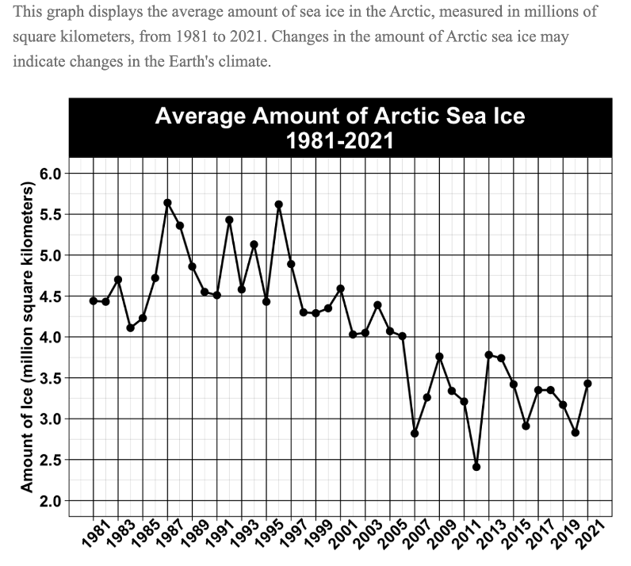
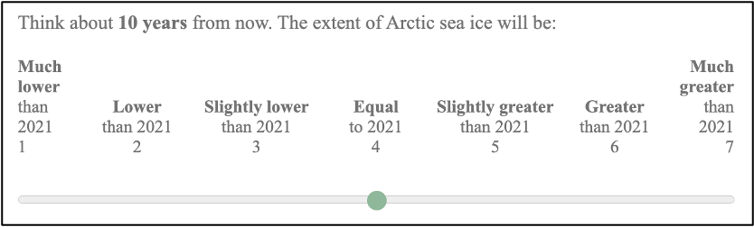
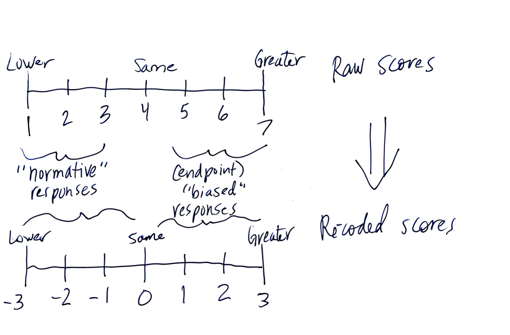
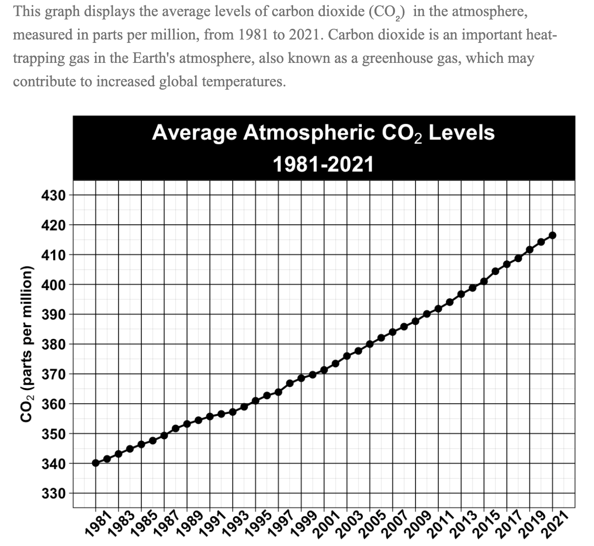

```{r mess-warn, include=FALSE}
knitr::opts_chunk$set(message=F, warning=F)
```

```{r lib, echo=F}
library(rio)
library(here)
library(janitor)
library(reshape2)

library(tidyverse)
library(ggplot2)
library(lme4)

library(knitr)
library(Hmisc)
library(viridis)
library(kableExtra)
```

```{r data, echo=F}
dfd1 <- import(here("analysis-data", "cleaned-data0815.csv"))
dfd1_dt <- import(here("analysis-data", "cleaned-data0815-exdt.csv"))
dfd1_flr <- import(here("analysis-data", "cleaned-data0815-exflr.csv"))

dfd1_lc <- dfd1 %>% 
  filter(conservatism_f != 4 | con != 0)
dfd1_lcdt <- dfd1_dt %>% 
  filter(conservatism_f != 4 | con != 0)
dfd1_lcflr <- dfd1_flr %>% 
  filter(conservatism_f != 4 | con != 0)

```

```{r func-se, echo=F}
se_f <- function(x) {
  
  if(length(x) > 0) {
    sd(x, na.rm = T) / sqrt(length(x))
  }
  else {
    999
  }
  
}
```

# Demographics
```{r Ss, echo=F}
n_total <- dfd1 %>% 
  nrow()

n_total_lc <- dfd1_lc %>% 
  nrow()

n_by_con <- dfd1 %>% 
  group_by(con) %>% 
  summarise(n = n(),
            percent = round(100 * (n()/nrow(dfd1)), 2))

n_by_con_lc <- dfd1_lc %>% 
  group_by(con) %>% 
  summarise(n = n(),
            percent = round(100 * (n()/nrow(dfd1_lc)), 2))

df_age <- dfd1_lc %>% 
  select(dem_age_b) %>% 
  psych::describe()

m_age <- df_age$mean %>% 
  round(2)
min_age <- df_age$min %>% 
  round(2)
max_age <- df_age$max %>% 
  round(2)

df_gender <- dfd1_lc %>% 
  group_by(gender_b) %>% 
  summarise(n = n(),
            percent = round(100 *(n()/nrow(dfd1)),2))

df_race <- dfd1_lc %>% 
  group_by(race_b) %>% 
  summarise(n = n(),
            percent = round(100 *(n()/nrow(dfd1)),2))
```

N$_{total}$ = `r n_total`: N$_{con}$ = `r n_by_con[3,2]`, N$_{lib}$ = `r n_by_con[1,2]`, N$_{mod}$ = `r n_by_con[2,2]`

**N$_{final}$ = `r n_total_lc`**

- **Political ideology:** `r n_by_con_lc[2,3]`% conservative, `r n_by_con_lc[1,3]`% liberal
- **Age:** Mean$_{age}$ = `r m_age` (range: `r min_age`-`r max_age`)
- **Gender:** `r df_gender[3,3]`% women, `r df_gender[1,3]`% men, `r df_gender[2,3]`% non-binary folks, `r df_gender[4,3]`% preferred not to answer
- **Race:** `r df_race[1,3]`% White, `r df_race[2,3]`% Black, `r df_race[3,3]`% Hispanic, `r df_race[4,3]`% Asian

# Descriptives
```{r add-desc-names, echo=F}
dfd1_lc <- dfd1_lc %>% 
  mutate(RPM = rav_scored,
         SciCuriosity = sc_scored,
         ConArctic = arctic20,
         ConTemp = temp20,
         LibOzone = ozone20,
         LibAir = airqual20,
         FillConCO2 = co220,
         FillConIce = icesheets20,
         FillDiaPop = diatho20,
         FillQuake = quake20,
         Con = con)
```

```{r cor-map-prep, echo=F}
dfp_corr <- dfd1_lc %>% 
  select(conservatism_f, sc_scored, rav_scored, arctic20, temp20, ozone20, airqual20, co220, icesheets20, diatho20, quake20) %>% 
  mutate(Con = conservatism_f,
         SciCur = sc_scored,
         RPM = rav_scored,
         ConArctic = arctic20,
         ConTemp = temp20,
         LibOzone = ozone20,
         LibAirQual = airqual20,
         FillConCO2 = co220,
         FillConIce = icesheets20) %>% 
  select(-contains("20"), -contains("scored"), -contains("_f"))
```

## Science curiosity and RPM

**Grouped by ideology**

```{r desc-table-ideo2, echo=F}
desc_scrpm_con <- dfd1_lc %>% 
  filter(Con == 1) %>% 
  select(SciCuriosity, RPM) %>%
  psych::describe()%>% 
  mutate(Min_c = min,
         Max_c = max,
         Mean_c = mean,
         SE_c = se) %>% 
  as.data.frame() %>% 
  select(Mean_c, SE_c, Min_c, Max_c)

desc_scrpm_lib <- dfd1_lc %>% 
  filter(Con == -1) %>% 
  select(SciCuriosity, RPM) %>%
  psych::describe()%>% 
  mutate(Min_l = min,
         Max_l = max,
         Mean_l = mean,
         SE_l = se) %>% 
  as.data.frame() %>% 
  select(Mean_l, SE_l, Min_l, Max_l)

cbind(desc_scrpm_con, desc_scrpm_lib) %>% 
  select(contains("_c"), contains("_l")) %>% 
  kable(digits = 2, align = "c",
        col.names = c(
          rep(c("Mean", "SE", "Min", "Max"), 2)
        )) %>% 
  add_header_above(c(" " = 1, "Conservative" = 4, "Liberal" = 4), line_sep = 25) %>% 
  kable_styling(full_width = F, position = "left")%>% 
  column_spec(column = 1, bold = T) %>% 
  column_spec(column = c(2,4,6,8), background = "lightgray") %>% 
  column_spec(column = c(1,5), border_right = T)
```

```{r prep-for-plot, echo=F}
desc_long <- dfd1_lc %>% 
  pivot_longer(cols = c(SciCuriosity, RPM, ConArctic, ConTemp, LibOzone, LibAir, FillConIce, FillConCO2, FillDiaPop, FillQuake), names_to = "Variable", values_to = "Score")

desc_long_mr <- desc_long %>% 
  filter(Variable != "SciCuriosity" & Variable != "RPM") 
```

```{r cont-plot, echo=F}
desc_long_cont <- desc_long %>% 
  filter(Variable == "SciCuriosity" | Variable == "RPM")

# desc_long_cont %>% 
#   select(Score) %>% 
#   unique()

desc_long_cont %>% 
  ggplot(., aes(x = as.factor(Con), y = Score, fill = as.factor(Con))) + 
  stat_summary(geom = "bar", fun = "mean", position = "dodge") +
  facet_wrap(~Variable, scales = "free_y") +
  scale_x_discrete(labels = c("Lib", "Con")) +
  scale_fill_manual(values = c("deepskyblue3", "brown3")) +
  theme_bw() +
  labs(title = "Average Cognitive Ability and Science Curiosity",
       y = "Average Score",
       x = "Ideology") +
  theme(axis.text.x = element_text(size = 12),
        axis.text.y = element_text(size = 12),
        axis.title.x = element_text(size = 14),
        axis.title.y = element_text(size = 14),
        legend.position = "none",
        plot.title = element_text(size = 16, face = "bold", hjust = .5))
```

## Motivated reasoning items

### A note on scoring these items







In this document, for the sake of simplicity, I'll refer to the recoded scores as "endpoint bias scores." However, as we've previously discussed (and as we'll see later in this doc), our findings do not necessarily support the idea that the mechanism behind polarization on these items is due to endpoint bias.

### Our findings

**Grouped by ideology**

```{r desc-table-ideo, echo=F}
desc_mr_con <- dfd1_lc %>% 
  filter(Con == 1) %>% 
  select(ConArctic, ConTemp, LibOzone, LibAir, FillConIce, FillConCO2, FillDiaPop, FillQuake) %>% 
  psych::describe()%>% 
  mutate(Min_c = min,
         Max_c = max,
         Mean_c = mean,
         SE_c = se) %>% 
  as.data.frame() %>% 
  select(Mean_c, SE_c, Min_c, Max_c)

desc_mr_lib <- dfd1_lc %>% 
  filter(Con == -1) %>% 
  select(ConArctic, ConTemp, LibOzone, LibAir, FillConIce, FillConCO2, FillDiaPop, FillQuake) %>%
  psych::describe() %>% 
  mutate(Min_l = min,
         Max_l = max,
         Mean_l = mean,
         SE_l = se) %>% 
  as.data.frame() %>% 
  select(Mean_l, SE_l, Min_l, Max_l)

cbind(desc_mr_con, desc_mr_lib) %>% 
  select(contains("_c"), contains("_l")) %>% 
  kable(digits = 2, align = "c",
        col.names = c(
          rep(c("Mean", "SE", "Min", "Max"), 2)
        )) %>% 
  add_header_above(c(" " = 1, "Conservative" = 4, "Liberal" = 4), line_sep = 25) %>% 
  kable_styling(full_width = F, position = "left")%>% 
  column_spec(column = 1, bold = T) %>% 
  column_spec(column = c(2,4,6,8), background = "lightgray") %>% 
  column_spec(column = c(1,5), border_right = T)
```

```{r eb-ideo-plot, echo=F}
desc_long_mr %>% 
  ggplot(., aes(x = Variable, y = Score, fill = as.factor(Con))) + 
  stat_summary(geom = "bar", fun = "mean", position = "dodge") +
  scale_fill_manual(values = c("deepskyblue3", "brown3"), name = "Ideology", labels = c("Lib", "Con")) +
  theme_bw() +
  scale_y_continuous(limits = c(-3, 1), breaks = seq(from  = -3, to = 1, by = .5)) +  
  labs(title = "Average Scores on Motivated Reasoning Items",
       subtitle = "Higher scores indicate more endpoint bias.",
       y = "Average Score",
       x = "Item") +
  theme(axis.text.x = element_text(angle = 45, size = 12, vjust = .6),
        axis.text.y = element_text(size = 12),
        axis.title.x = element_text(size = 14),
        axis.title.y = element_text(size = 14),
        legend.text = element_text(size = 12),
        legend.title = element_text(size = 12),
        plot.title = element_text(size = 16, face = "bold", hjust = .5),
        plot.subtitle = element_text(size = 12, hjust = .13))
```

# Quick and dirty "3-way interaction" means

```{r add-cong-var, echo=F}
dfd2_lc <- dfd1_lc %>% 
  mutate(ArcticCong = case_when(
    Con == 1 ~ 1,
    Con == -1 ~ 0,
    TRUE ~ 999),
    TempCong = case_when(
      Con == 1 ~ 1,
      Con == -1 ~ 0,
      TRUE ~ 999),
    OzoneCong = case_when(
      Con == 1 ~ 0,
      Con == -1 ~ 1,
      TRUE ~ 999),
    AirCong = case_when(
      Con == 1 ~ 0,
      Con == -1 ~ 1,
      TRUE ~ 999),
    CO2Cong = case_when(
      Con == 1 ~ 1,
      Con == -1 ~ 0,
      TRUE ~ 999),
    IceCong = case_when(
      Con == 1 ~ 1,
      Con == -1 ~ 0,
      TRUE ~ 999)
         )
```

```{r scrpm-hilow, echo=F}
dfd2_lc <- dfd2_lc %>% 
  mutate(sc3 = case_when(
    sc_scoredz < -1.5 ~ "Below Avg",
    sc_scoredz >= -1.5 & sc_scoredz <= 1.5 ~ "Avg",
    sc_scoredz > 1.5 ~ "Above Avg"
  ),
  rpm3 = case_when(
    rav_scoredz < -1.5 ~ "Below Avg",
    rav_scoredz >= -1.5 & rav_scoredz <= 1.5 ~ "Avg",
    rav_scoredz > 1.5 ~ "Above Avg"
  ),
  ideo2 = case_when(
    con == 1 ~ "Con",
    con == -1 ~ "Lib"
  )
  )
```

```{r 3way-means, echo = F}
int_means <- dfd2_lc %>% 
  group_by(sc3, ideo2) %>% 
  summarise_at(vars("ConArctic", "ConTemp", "LibOzone", "LibAir"), funs(mean, se_f, length))

int_means_tab <- int_means %>% 
  select(-contains("length")) %>% 
  select(sc3, ideo2, contains("Arctic"), contains("Temp"), contains("Ozone"), contains("Air"))

int_means_tab %>% 
  select(ideo2, sc3, everything()) %>% 
  arrange(ideo2, sc3) %>% 
  kable(digits = 2,
        align = "c",
        col.names = c("", "SciCur", "Con1_M", "Con1_SE", "Con2_M", "Con2_SE", "Lib1_M", "Lib1_SE", "Lib2_M", "Lib2_SE")) %>% 
  add_header_above(c(" " = 2, "Conservative" = 4, "Liberal" = 4), line_sep = 25) %>%
  kable_styling(position = "left") %>% 
  row_spec(row = c(1, 2, 3), background = "lightgray") %>% 
  column_spec(column = c(7, 8, 9, 10), background = c("white", "white", "white", "lightgray", "lightgray", "lightgray")) %>% 
  column_spec(column = 1, bold = T, color = "white", background = c("red", "red", "red", "blue", "blue", "blue")) %>% 
  column_spec(column = c(2, 4, 6, 8), border_right = T) %>% 
  column_spec(column = 2, background = "white") %>% 
  footnote(general = "* Higher scores indicate MORE endpoint bias \n * M = mean, SE = standard error \n * Item names: Con1 = arctic sea ice, Con2 = global temperature index, Lib1 = ozone layer hole, Lib2 = US air quality")
```

**Table color coding.**
The areas of the table highlighted in gray indicate for each item whether the endpoint bias was congruent with conservative or liberal beliefs. For example, Con1 and Con2 portrayed endpoint bias congruent with conservative beliefs, so the top gray square highlights the Ms and SEs of conservative participants for each item, grouped by science curiosity scores.

**Science curiosity groupings.**
Above avg: z > 1.5, Avg: -1.5 <= z >= 1.5, Below Avg: z < -1.5

**What would we predict?**
If our hypothesis were correct, in the gray areas of this table, there would be a negative relation between science curiosity and endpoint bias scores, indicating that higher science curiosity scores were associated with less biased responding.

**Looking at these means, what do we see?**
The second conservative item (Con2; related to global temperature) does demonstrate directional consistency with this hypothesis among conservatives (*and* liberals, but with larger SEs). Furthermore, the second liberal item (Lib2; related to air quality) displays directional consistency among conservatives but not liberals.

## Is it endpoint bias?

Unlike other studies, we included a few filler items in the motivated reasoning task, two of which were politicized but with clear trends and no endpoint discrepancy.



```{r 3way-means-fill, echo = F}
int_means <- dfd2_lc %>% 
  group_by(sc3, ideo2) %>% 
  summarise_at(vars("ConArctic", "ConTemp", "FillConCO2", "FillConIce"), funs(mean, se_f, length))

int_means_tab <- int_means %>% 
  select(-contains("length")) %>% 
  select(sc3, ideo2, contains("Arctic"), contains("Temp"), contains("CO2"), contains("Ice"))

int_means_tab %>% 
  select(ideo2, sc3, everything()) %>% 
  arrange(ideo2, sc3) %>% 
  kable(digits = 2,
        align = "c",
        col.names = c("", "SciCur", "Con1_M", "Con1_SE", "Con2_M", "Con2_SE", "Fill1_M", "Fill1_SE", "Fill2_M", "Fill2_SE")) %>% 
  add_header_above(c(" " = 2, "Cons MR Items" = 4, "Con Filler Items" = 4), line_sep = 25) %>%
  kable_styling(position = "left") %>% 
  row_spec(row = c(1, 2, 3), background = "lightgray") %>% 
  # column_spec(column = c(7, 8, 9, 10), background = c("white", "white", "white", "lightgray", "lightgray", "lightgray")) %>% 
  column_spec(column = 1, bold = T, color = "white", background = c("red", "red", "red", "blue", "blue", "blue")) %>% 
  column_spec(column = c(2, 4, 6, 8), border_right = T) %>% 
  column_spec(column = c(2, 3, 4, 5, 6), background = "white") %>% 
  footnote(general = "* Higher scores indicate MORE endpoint (?) bias \n * M = mean, SE = standard error \n * Item names: Con1 = arctic sea ice, Con2 = global temperature index, Fill1 = CO2 levels, Lib2 = ice sheet area")
```

**What's going on?**
As we would expect, because their trends were not ambiguous, endpoint bias scores were lower for the filler items compared to the motivated reasoning items. Interestingly, though, they were still significantly polarized by ideology, despite the fact that we instructed participants to make their prediction "based on the given information."

**So what?**
Based on these results, we can't necessarily determine whether endpoint bias was the mechanism behind polarized responding. In the case of these filler items, we know that it was not simply based on the definition of endpoint bias. Does this indicate, even in our motivated reasoning items, that this is not so much motivated reasoning as biased responding based on existing attitudes? Or are two different mechanisms at play between the filler and the endpoint items? We'd need to know more about the precise reasoning (or lack thereof) that formed their responses. This is one potential question we could examine in a follow-up study, potentially independent of science curiosity.